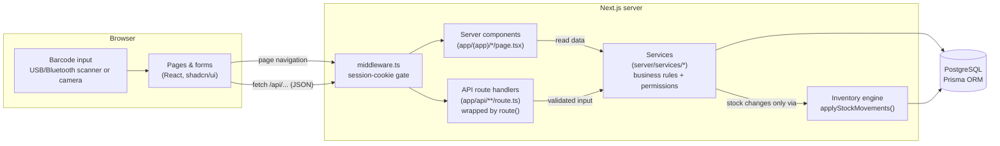

# Hosiery ERP — Technical Documentation

This folder explains how every part of the Hosiery ERP works, from the moment a user clicks a button to the rows written in the database. Each document follows a feature end to end: the screen, the API call, the server logic, the database changes, and the rules that protect the data.

> New to the codebase? Read **[Architecture](architecture.md)** and **[Inventory engine](inventory-engine.md)** first. Almost every feature is built on those two.

## Contents

| # | Document | What it covers |
|---|---|---|
| 1 | [Architecture](architecture.md) | Layers, folder layout, request lifecycle, the `route()` API wrapper, errors, validation, logging |
| 2 | [Authentication, roles & permissions](security-auth.md) | Login, sessions, middleware, roles, permission checks, CSRF, rate limiting, password changes |
| 3 | [Database](database.md) | ER diagram, every model, constraints, indexes, document numbering, money & quantity precision, migrations |
| 4 | [Inventory engine](inventory-engine.md) | The stock ledger, `applyStockMovements`, sellable/damaged buckets, concurrency, idempotency, integrity check, inventory screens |
| 5 | [Products & barcodes](products-barcodes.md) | Product master, variants, SKUs, barcode generation/lookup, search, labels, images, categories |
| 6 | [Sales & POS](sales-pos.md) | POS screen, scanning, cart maths, payment rules, invoice, printing, credit collection, cancellation |
| 7 | [Purchases & supplier returns](purchases.md) | Drafts, receiving stock, duplicate-invoice protection, payments, cancellation, returns to supplier |
| 8 | [Dispatch](dispatch.md) | Order status flow, scan-verified packing, shipping, delivery |
| 9 | [Customer returns](returns.md) | Return limits, good vs damaged stock, refund calculation |
| 10 | [Stock adjustments](stock-adjustments.md) | Damage, write-off, lost, found, corrections |
| 11 | [Manufacturing](manufacturing.md) | Bills of materials, availability check, production, cancellation |
| 12 | [Customers & suppliers](customers-suppliers.md) | Party masters, history, balances, POS customer picker |
| 13 | [Dashboard & reports](dashboard-reports.md) | Dashboard cards and charts, the five reports, date ranges & timezone, CSV export |
| 14 | [Users, settings & audit log](admin.md) | User management, business settings, the audit trail |
| 15 | [Frontend](frontend.md) | App shell, navigation, quick actions, shared components, URL filters, scanning components, keyboard shortcuts |
| 16 | [API reference](api-reference.md) | Every endpoint: method, permission, input, output |
| 17 | [Testing](testing.md) | Unit, integration and end-to-end suites, test databases, what each test proves |
| 18 | [Deployment & operations](deployment-operations.md) | Environment variables, local setup, Docker, Vercel + Supabase, seeding, troubleshooting |

## The system in one picture

## Core ideas (the short version)

1. **Stock is never typed in.** Every quantity change (purchase, sale, return, damage, production…) writes a row to the **stock ledger** (`InventoryTransaction`). The current balance in `StockLevel` is updated in the same database transaction. See [Inventory engine](inventory-engine.md).
2. **All or nothing.** Each business document (a sale, a purchase receipt, a production run…) is saved in **one database transaction** together with its ledger rows and audit entry. If any step fails, nothing is saved.
3. **The server decides.** The browser shows previews, but the server recalculates prices, totals, stock availability and permissions for every request. Roles are never trusted from the client.
4. **History is never deleted.** Mistakes are undone with *cancellations* that post reversal entries, so the ledger always adds up.
5. **Safe to click twice.** Every form sends an *idempotency key*, so double-clicks, network retries and refreshes can never create a second sale, purchase, return or production.

## Glossary

| Term | Meaning |
|---|---|
| **Product** | A catalogue item, e.g. "Cotton Crew Socks". Has a type (finished good or raw material) and a unit. |
| **Variant** | One sellable/stockable version of a product, e.g. size M / colour Black. Has its own SKU, barcode, prices and stock. All stock is tracked per variant. |
| **SKU** | Internal stock-keeping code for a variant (e.g. `CCS-M-BLACK`). Unique. |
| **Barcode** | The code printed on the item (EAN-13, Code 128…). Unique. A scan finds exactly one variant. |
| **Sellable stock** | `StockLevel.onHand`: what can be sold. |
| **Damaged stock** | `StockLevel.damaged`: held separately; never sold. |
| **Ledger / stock movement** | One `InventoryTransaction` row: `+qty` or `−qty` with the balance after it. |
| **Document** | A business record that may move stock: Sale, Purchase, CustomerReturn, SupplierReturn, StockAdjustment, Production. |
| **Actor** | The signed-in user performing an operation, resolved on the server from the session cookie. |
| **Idempotency key** | A random ID generated once per form; stored with a UNIQUE constraint so a resubmission returns the original document. |
| **BOM** | Bill of materials: raw materials needed to make a finished variant. |
| **Walk-in Customer** | The default customer for a sale with no customer selected. |
