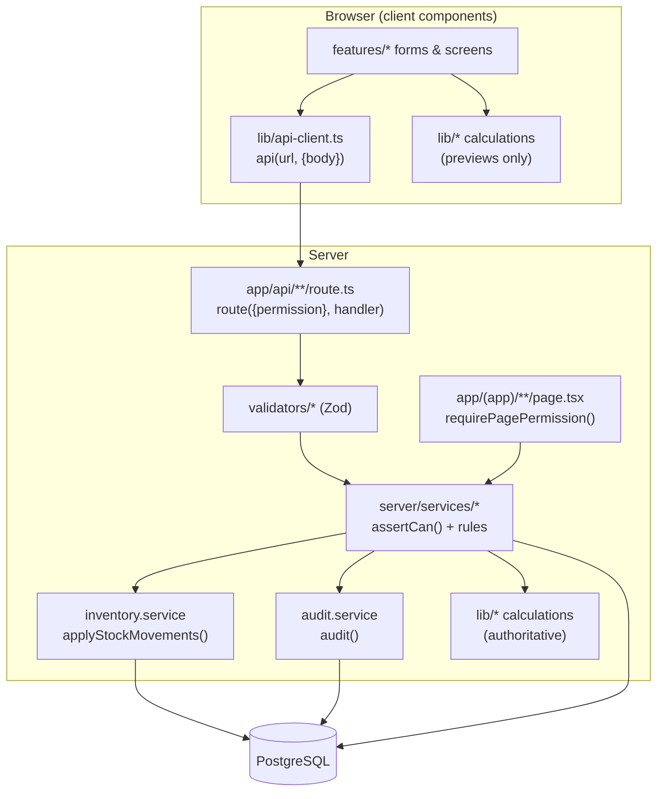
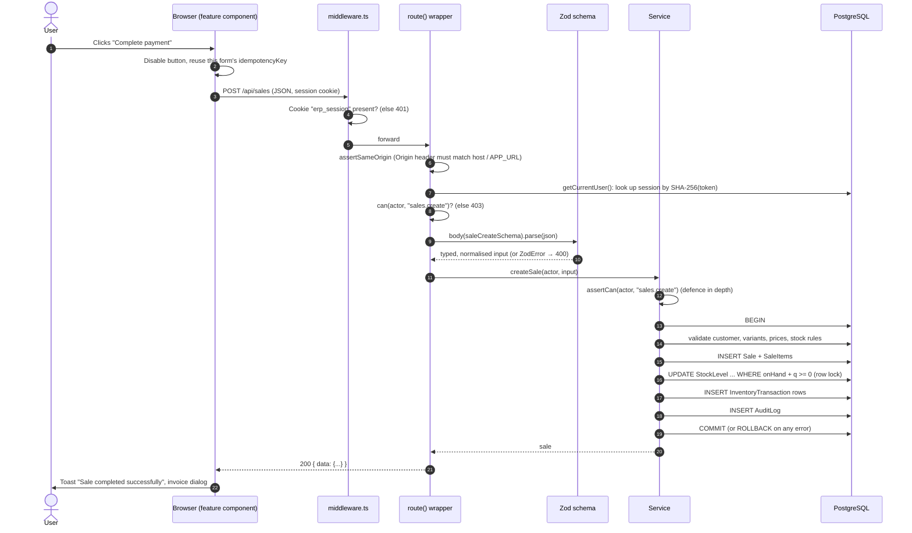

# Architecture

[← Back to index](README.md)

## Technology

| Layer | Technology |
|---|---|
| Framework | Next.js 15 (App Router), React 19, TypeScript |
| UI | Tailwind CSS 4, shadcn/ui (Radix primitives), Lucide icons, Sonner toasts |
| Forms & validation | React Hook Form + Zod (the same Zod schemas validate on the server) |
| Client data | TanStack Query (search-as-you-type, previews), TanStack Table (inventory table) |
| Server | Next.js server components (pages) and route handlers (`/api/*`) |
| Database | PostgreSQL 16+ via Prisma 6 |
| Exact maths | `decimal.js` for money and quantities |
| Barcodes | ZXing (camera, lazy-loaded), JsBarcode (label printing) |
| Charts | Recharts (lazy-loaded) |
| Tests | Vitest (unit + integration against real PostgreSQL), Playwright (end-to-end) |

## Folder layout

```text
prisma/
  schema.prisma          database models, enums, indexes
  migrations/            SQL migrations (init, integrity CHECKs, stored files)
  seed.ts                demo or production seed, built on the real services
scripts/
  check-deploy-env.mjs   fails a Vercel build if database env vars are wrong
src/
  middleware.ts          edge gate: no session cookie → /login (or 401 for APIs)
  app/
    layout.tsx           root HTML, fonts, providers, toaster
    login/ unauthorized/ not-found.tsx global-error.tsx
    (app)/               every signed-in page (shares the app shell)
      layout.tsx         requireUser() + SessionProvider + AppShell
      dashboard/ sales/ purchases/ dispatch/ returns/ inventory/ products/
      manufacturing/ suppliers/ customers/ reports/ audit/ users/ settings/
    api/                 JSON route handlers, one folder per resource
  components/
    ui/                  shadcn/ui primitives (generated)
    layout/              app shell, sidebar nav, command palette, password dialog
    shared/              tables, pagination, URL filters, badges, states, confirm dialog, Link
    scanner/             camera scanner, product search/scan box
    providers/           TanStack Query provider, session (role) context
    charts/              lazy bar chart
  features/              client components per module (pos, purchases, returns…)
  hooks/                 useDebounced, useScannerListener
  lib/                   pure shared code (runs in browser AND server)
    decimal.ts calculations.ts permissions.ts barcode.ts dates.ts format.ts csv.ts
    api-client.ts feedback.ts search-params.ts
  validators/            Zod schemas (common, masters, transactions, settings)
  server/                server-only code
    db.ts                Prisma client + transaction() helper
    errors.ts            AppError + safe error mapping
    idempotency.ts       idempotent() helper
    logger.ts            JSON logger
    api/handler.ts       route() wrapper for every API endpoint
    auth/                session cookie, password hashing, rate limiter, actor/permission checks
    services/            ALL business logic (one file per domain)
tests/
  unit/ integration/ e2e/
```

### The rule that keeps it modular

* **`lib/`** is pure: no database, no Next.js. Calculations here (cart totals, refunds, BOM maths, permissions) run identically in the browser (for previews) and on the server (for the real values).
* **`server/services/`** owns every business rule. Pages and API routes never write to the database directly; they call a service.
* **Pages and API routes are thin.** A page reads data through a service; an API route validates input with Zod and calls a service.
* **Every service function receives an `actor`** and starts with `assertCan(actor, "<permission>")`, so permissions are enforced even if a service is called from somewhere new.



## Two ways data moves

### 1. Reading: server components

Every page in `app/(app)/` is an **async server component**. It:

1. Calls `requirePagePermission("<permission>")`. That reads the session cookie, loads the user, and redirects to `/login` (no session) or `/unauthorized` (wrong role).
2. Reads URL search params (`?q=`, `?page=`, filters) through the helpers in `lib/search-params.ts` (`str`, `int`, `oneOf`). These never trust raw input.
3. Calls one or more service functions (e.g. `listSales(actor, {...})`).
4. Renders HTML on the server and sends it to the browser.

Pages are `force-dynamic` (set in `app/(app)/layout.tsx`): they always show live data and are never cached.

### 2. Writing: API route handlers

Every create/update/delete goes through a JSON endpoint under `/api`. The browser calls it with `api()` from `lib/api-client.ts`:

```ts
await api("/api/sales", { body: { items, paymentMode, idempotencyKey } });
```

Each endpoint is a one-liner around `route()`:

```ts
export const POST = route({ permission: "sales.create" }, async ({ actor, body }) =>
  createSale(actor, await body(saleCreateSchema)),
);
```

## Request lifecycle (a mutation, end to end)



## The `route()` wrapper (`src/server/api/handler.ts`)

`route(options, handler)` returns a Next.js route function that does, in order:

1. **Same-origin check** for anything other than GET/HEAD (`assertSameOrigin`). If the request carries an `Origin` header, its host must equal the request host (or `x-forwarded-host`) or the host of `APP_URL`. Otherwise it returns **403 "Cross-site request blocked"**. Requests without an `Origin` header (curl, server-to-server) still need a valid session cookie.
2. **Authentication.** `getCurrentUser()` resolves the session; no user returns **401**.
3. **Permission.** If `options.permission` is set and the role lacks it, returns **403**.
4. **Params.** Awaits Next.js dynamic segment params (e.g. `{ id }`).
5. Calls the handler with helpers:
   * `body(schema)`: parses the JSON body (invalid JSON → 400) and validates it with Zod.
   * `query(schema)`: validates the query string with Zod.
6. **Response.** A returned `Response` (e.g. a CSV file) is passed through; anything else is wrapped as `{ "data": ... }` with status 200.
7. **Errors.** Any thrown value goes through `errorResponse()` → `toAppError()` and becomes `{ "error": { code, message, details } }` with the right HTTP status.

Login, logout, health and image download don't use `route()`, because they work without a session. They still apply the same-origin check where they mutate.

## Errors (`src/server/errors.ts`)

All expected failures are `AppError`s with a **code**, a user-safe **message** and optional **details**:

| Code | HTTP | Typical cause |
|---|---|---|
| `VALIDATION` | 400 | Bad input (Zod), whole-number unit given a decimal, discount too large |
| `UNAUTHENTICATED` | 401 | No/expired session, wrong password, disabled account |
| `FORBIDDEN` | 403 | Role lacks permission, cross-site request, price override without permission |
| `NOT_FOUND` | 404 | Unknown product, invoice, supplier… |
| `CONFLICT` | 409 | Duplicate SKU/barcode/invoice, document already received/cancelled/packed |
| `INSUFFICIENT_STOCK` | 409 | Sale, production, cancellation or adjustment would make stock negative. `details.shortages` lists each item with required/available. |
| `BUSINESS_RULE` | 422 | Domain rule broken: return over limit, dispatch quantities don't match, inactive item… |
| `RATE_LIMITED` | 429 | Too many login attempts |
| `INTERNAL` | 500 | Anything unexpected (logged; the user sees "Something went wrong") |

`toAppError()` translates library errors so **raw database errors never reach users**:

* `ZodError` → `VALIDATION`, with the first issue as the message and all issues in `details.issues`.
* `CalculationError` (from `lib/calculations.ts`) → `VALIDATION`.
* Prisma `P2002` (unique violation) → `CONFLICT` "SKU already exists" (field names mapped to friendly labels).
* Prisma `P2025` → `NOT_FOUND`; `P2003` → `CONFLICT`; `P2034` (write conflict) → `CONFLICT` "changed by someone else".
* Everything else → logged with `logger.error`, returned as `INTERNAL`.

On the client, `api()` throws an `ApiError` carrying the same code/message/details. Screens show `errorMessage(err)` in a toast. Some screens use `details` to highlight rows, e.g. dispatch mismatches.

## Validation (`src/validators/`)

The same Zod schema is used by the form (via `zodResolver`) and by the API (`body(schema)`), so the rules can't drift apart.

* **Money and quantities travel as strings** (`"120.50"`, `"0.045"`) so they stay exact. `common.ts` defines:
  * `zMoney`: up to 10 digits and 2 decimals, ≤ 10,000,000.
  * `zQty`: positive, up to 3 decimals, ≤ 1,000,000.
  * `zQtyNonNeg`: same but allows 0/empty (thresholds, opening stock).
  * `zPercent`: 0–100 with 2 decimals.
* Text fields are trimmed; empty optional strings become `null`.
* Phone numbers are normalised (spaces/dashes removed), emails lower-cased, SKUs and product codes upper-cased.
* `zBarcode`: 3–64 characters from `A–Z a–z 0–9 - _ .`.
* Cross-field rules use `superRefine`, e.g. no duplicate SKU/barcode/size-colour inside one new product, no duplicate material in one BOM.
* Rules that need the database or the product's unit (whole-number units, stock, return limits) are checked in the services.

## Database transactions (`src/server/db.ts`)

```ts
transaction(async (tx) => { ... })   // prisma.$transaction, maxWait 10 s, timeout 20 s
```

Every write in a document flow uses the same `tx`. If any statement throws (a business rule, a CHECK constraint, a unique violation), PostgreSQL rolls back **everything**: the document, its lines, ledger rows, balance updates, counters and the audit entry.

## Logging (`src/server/logger.ts`)

One JSON line per entry: `{ ts, level, message, meta }`. Errors always log; `debug` is suppressed in production; tests only log errors. `INTERNAL` API errors log the path and method. Expected errors (validation, permissions…) aren't logged, to avoid noise.

## Performance choices

* **Server-side pagination** on every list (25 rows by default, 50 for ledgers/audit). Searches and status filters run in SQL, so large catalogues stay fast.
* **Indexes** on SKU, barcode, product name (trigram GIN for fast `ILIKE`), invoice numbers, parties and dates. See [Database](database.md).
* **Barcode lookup** is an exact indexed match (`barcode = ?`, then `lower(sku) = ?`).
* The **POS updates the cart locally** on every scan and caches scanned codes; only the final sale goes to the server.
* **Heavy libraries are lazy-loaded**: the camera decoder (ZXing) loads only when the camera opens; charts only when a chart renders.
* **No automatic link prefetching** (`components/shared/app-link.tsx`). Pages are dynamic and per-user, so prefetching only cost server renders. See [Frontend](frontend.md).
