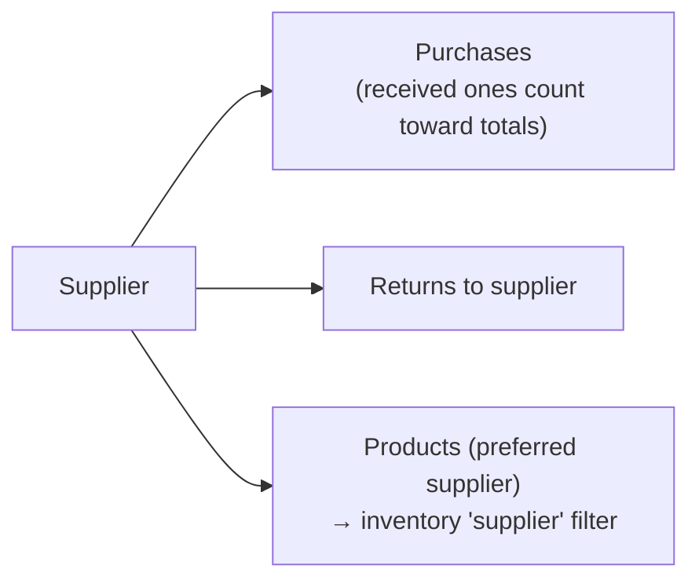
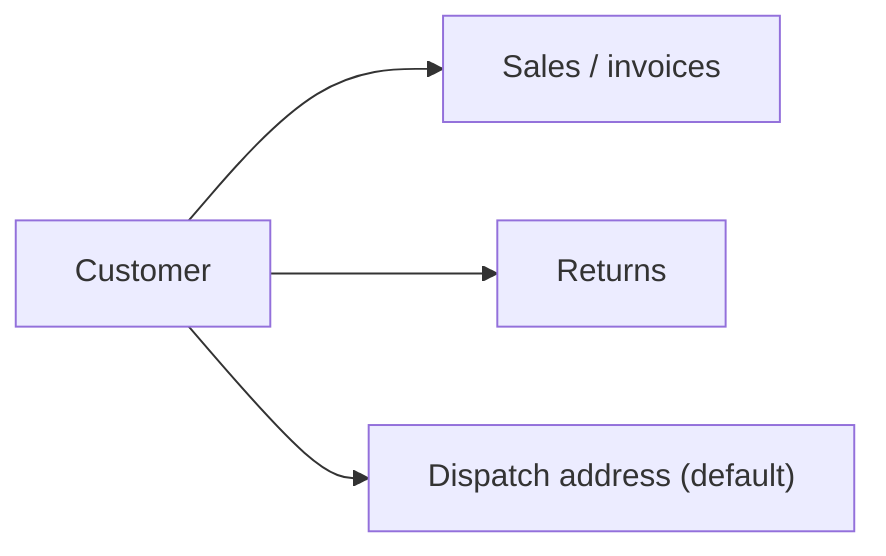

# Customers & suppliers

[← Back to index](README.md)

Files: `src/server/services/party.service.ts`, `src/features/parties/party-form-sheet.tsx`, `src/features/pos/customer-picker.tsx`, `src/validators/masters.ts` (`supplierSchema`, `customerSchema`), pages `src/app/(app)/suppliers/*`, `src/app/(app)/customers/*`.

## Adding and editing

Both use the same drawer (`PartyFormSheet`): *Add supplier* / *Add customer* on the list page, *Edit* on the detail page.

| Field | Supplier | Customer | Rules |
|---|:-:|:-:|---|
| Name | required | required | 2–120 characters |
| Phone | optional | optional, **unique** | 6–20 digits; `+`, spaces and dashes accepted then removed |
| Email | optional | optional | valid email, stored lower-case |
| Address | optional | optional | ≤ 500 chars |
| GSTIN | optional | — | exactly 15 letters/digits, upper-cased |
| Notes | optional | optional | ≤ 1000 chars |
| Active | ✔ | ✔ | inactive parties stay in history but can't be used on new documents |

* **Supplier names are unique** (case-insensitive): "Supplier "X" already exists".
* **Customer phone numbers are unique**: "Phone 98… already belongs to Ravi Kumar". This keeps POS phone search unambiguous.
* Create → `POST /api/suppliers` / `POST /api/customers`. Update → `PATCH /api/.../:id`. Updates are audited with a field-by-field diff (`supplier.update`, `customer.update`).

## Suppliers

**List (`/suppliers`):** search by name, phone or GSTIN; filter active / inactive / all. Columns: supplier, phone, GSTIN, purchase count. Admins also see **total purchased** and **payable** (outstanding = received purchase totals − amount paid).

**Detail (`/suppliers/[id]`):**

* Cards: received purchases, total purchases, outstanding payable.
* Address and notes.
* Recent purchases (last 20, any status) with payment status.
* Returns to this supplier (last 10).
* *New purchase* opens the purchase form with this supplier pre-selected (`/purchases/new?supplier=`).

Rules elsewhere: an **inactive supplier** can't be used on a new purchase ("Supplier "X" is inactive").

## Customers

**Walk-in sales need no customer.** The invoice shows "Walk-in Customer". A customer is required only for:

* credit or partially paid sales (someone has to owe the balance), and
* dispatch orders without a typed delivery address.

**List (`/customers`):** search by name, phone or email; filter active / inactive / all. Columns: customer, phone, invoices, total sales (confirmed), balance due.

**Detail (`/customers/[id]`):**

* Cards: invoices, total sales, total refunds, balance due.
* Recent invoices (last 20) with status and amount due per invoice.
* Returns (last 20) with invoice, date, quantity and refund.

An **inactive customer** can't be chosen for a new sale and is hidden from the POS customer search.

## Fast customer selection in the POS

`GET /api/customers?q=…` → `searchCustomers()`: active customers whose **name contains** the text or whose **phone contains** the digits (spaces/dashes ignored). Up to 10, sorted by name. The picker also lets sales staff **add a customer inline** (name + phone) without leaving the bill. See [Sales & POS](sales-pos.md#customer-selection).

## Balances: how they're computed

There's no separate accounts ledger; balances come from the documents:

| Figure | Formula |
|---|---|
| Customer total sales | Σ `Sale.total` where status = CONFIRMED |
| Customer balance due | Σ (`total − amountPaid`) of confirmed sales |
| Customer refunds | Σ `Sale.refundedAmount` |
| Supplier total purchases | Σ `Purchase.total` where status = RECEIVED |
| Supplier payable | Σ (`total − amountPaid`) of received purchases |

Payments are recorded on the individual invoice (*Collect payment*) or purchase (*Record payment*).
