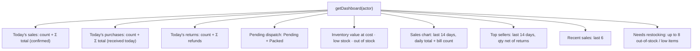

# Dashboard & reports

[← Back to index](README.md)

Files: `src/server/services/report.service.ts`, `src/lib/dates.ts`, `src/lib/csv.ts`, `src/features/reports/*`, `src/components/charts/bar-chart.tsx`, pages `src/app/(app)/dashboard/*`, `src/app/(app)/reports/*`, CSV route `src/app/api/reports/[kind]/csv/route.ts`.

## Dates and the business timezone

Timestamps are stored in **UTC**. "Today", "this week" and so on are worked out **on the server in the business timezone** (Settings → Timezone, default `Asia/Kolkata`). Reports therefore show the same figures whatever the browser's timezone.

`resolveRange(preset, tz, {from, to})` returns `{ from, to, fromKey, toKey, preset }`, where `from` is inclusive and `to` exclusive:

| Preset | Range (business timezone) |
|---|---|
| `today` | 00:00 today → 00:00 tomorrow |
| `yesterday` | the previous day |
| `week` | Monday of this week → end of today |
| `month` | 1st of this month → end of today |
| `last30` | the last 30 days including today |
| `custom` | `from`–`to` day keys (`YYYY-MM-DD`); swapped if reversed; invalid input falls back to today |

Example: at 01:30 IST on 10 Oct, "today" is `2026-10-09T18:30Z` → `2026-10-10T18:30Z`. A unit test covers this.

Daily charts group rows by the local day in SQL:

```sql
to_char(("createdAt" AT TIME ZONE 'UTC') AT TIME ZONE $tz, 'YYYY-MM-DD')
```

Days with no activity are filled with zero (`dayKeys`), so charts have no gaps.

## Dashboard (`/dashboard`)

All roles can open it (`dashboard.view`). Money values need `dashboard.financials` (admin); other roles see "—" for amounts and a note instead of the sales chart.



Every card is a link: low stock → `/inventory?status=low`, pending dispatch → `/dispatch`, and so on. *New sale* and *Receive stock* buttons appear for roles that can do them. All queries run in parallel; the chart library loads lazily, after the page.

## Reports (`/reports/*`, admin only: `reports.view`)

Every report has the same range bar (Today · Yesterday · This week · This month · Last 30 days · custom from/to · *Apply*) and an **Export CSV** button. The range lives in the URL (`?range=custom&from=…&to=…`) and carries over when you switch report tabs.

### Sales report (default: today)

| Figure | Definition |
|---|---|
| Number of sales | confirmed sales created in the range (cancelled are counted separately and excluded) |
| Sales value | Σ total |
| Items sold | Σ line quantities |
| Discounts | Σ line discounts + Σ bill discounts |
| Tax | Σ tax |
| Collected | Σ amount paid at sale time + later collections (current `amountPaid`) |
| Returns | count, quantity and Σ refund of returns created in the range |
| Net sales | sales value − returns value |

Also: daily sales chart, breakdown **by payment mode** (count and total), **top 10 products** (quantity and value net of returns), and the invoice list (up to 500, all statuses, linked).

CSV columns: Invoice, Date, Customer, Status, Payment mode, Payment status, Lines, Total, Paid, Refunded.

### Purchase report (default: this month)

Based on purchases **received** in the range (`receivedAt`).

| Figure | Definition |
|---|---|
| Purchase count / value | count, Σ total |
| Items purchased | Σ line quantities |
| Tax | Σ tax |
| Outstanding payable | Σ (total − paid) |

Also: daily chart, breakdown **by supplier**, and the purchase list. CSV columns: Purchase, Received, Supplier, Supplier invoice, Lines, Total, Paid, Payment status.

### Inventory report (live, no date range)

Cards: stock value at cost, active variants, low stock, out of stock. Table (50 per page) with a status filter (all / low / out / in stock / damaged): item, SKU, sellable, damaged, min, value, status.

CSV (all variants, respecting the status filter): Product, Code, Type, Size, Colour, SKU, Barcode, Unit, Sellable, Damaged, Min stock, Reorder level, Cost, Price, Stock value, Status.

### Stock movement report (default: this week)

* **Summary by movement type**: for each ledger type and bucket, total in, total out and number of entries. Purchases, sales, returns, adjustments and production are all visible at a glance.
* **Every ledger entry** in the range (50 per page), filterable by type: date, type (damaged marked), reference, item, in, out, balance after, user.

CSV: Date, Type, Reference, Product, SKU, Stock (bucket), Qty in, Qty out, Balance, User, Note (up to 50,000 rows).

### Production report (default: this month)

| Figure | Definition |
|---|---|
| Production runs | completed runs in the range |
| Finished goods produced | Σ quantity of completed runs |
| Raw material cost | Σ consumed qty × current cost price |

Tables: **finished goods produced** per item (runs, quantity), **raw material consumption** per material (quantity, cost), and the run list. CSV: Run, Date, Product, Quantity, Unit, Status, By.

## CSV export

`GET /api/reports/{sales|purchases|inventory|stock-movement|production}/csv?range=…`

* Uses the same service functions and permission (`reports.view`) as the pages, so the numbers match.
* `toCsv()` writes RFC 4180 CSV with a UTF-8 BOM, so Excel opens ₹ and other characters correctly.
* **Formula-injection safe:** text cells starting with `=`, `+`, `-`, `@`, tab or CR are prefixed with `'` (plain negative numbers aren't).
* File name: `<kind>-<from>_to_<to>.csv`. `Cache-Control: no-store`.
