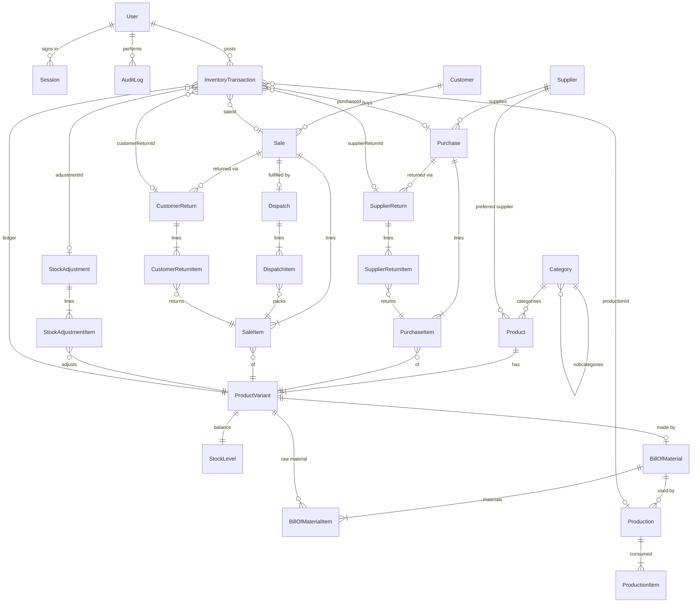

# Database

[← Back to index](README.md)

PostgreSQL, accessed through Prisma. Schema: `prisma/schema.prisma`. Migrations: `prisma/migrations/`.

## Entity relationship diagram



## Models

### Auth

| Model | Purpose | Key fields |
|---|---|---|
| **User** | Staff account | `username` (unique, lower-case), `email` (unique, optional), `passwordHash` (bcrypt), `role` (`ADMIN`/`STORE`/`SALES`), `isActive`, `lastLoginAt` |
| **Session** | One sign-in | `tokenHash` (unique SHA-256 of the cookie token), `userId`, `expiresAt`, `lastSeenAt`, `ip`, `userAgent`. Deleted on logout, role change, deactivation, password change. Cascade-deleted with the user. |

### Settings & numbering

| Model | Purpose | Key fields |
|---|---|---|
| **Setting** | Single row (`id = 1`) of business settings | `businessName`, `address`, `phone`, `email`, `gstin`, `currency` (INR default), `timezone` (Asia/Kolkata default), `taxEnabled`, `taxRate`, `taxLabel` (GST), `allowNegativeStock` (false), `invoiceFooter`. Created automatically on first use with `INSERT … ON CONFLICT DO NOTHING`. |
| **Counter** | Document number sequences | `key` (prefix) → `value`. Incremented atomically. |

**Document numbers.** `nextNumber(tx, prefix)` (in `settings.service.ts`) runs:

```sql
INSERT INTO "Counter" ("key","value") VALUES ($prefix, 1)
ON CONFLICT ("key") DO UPDATE SET "value" = "Counter"."value" + 1
RETURNING "value";
```

It runs inside the document's transaction. If the document fails, the increment rolls back too, so numbers have no gaps from failed saves. The format is `PREFIX-00001`.

| Prefix | Document |
|---|---|
| `INV` | Sale / invoice |
| `PUR` | Purchase |
| `SRT` | Supplier return |
| `RET` | Customer return |
| `DSP` | Dispatch |
| `ADJ` | Stock adjustment |
| `PRD` | Production run |
| `OPN` | Opening stock entered with a new product/variant |

### Masters

| Model | Purpose | Key fields |
|---|---|---|
| **Category** | Two-level tree | `name`, `parentId` (null = top level; subcategories can't nest further). Unique `(parentId, name)`. |
| **Supplier** | Who you buy from | `name`, `phone`, `email`, `address`, `gstin`, `notes`, `isActive` |
| **Customer** | Who you sell to | `name`, `phone` (unique), `email`, `address`, `notes`, `isActive` |
| **Product** | Catalogue item | `name`, `code` (unique), `type` (`FINISHED_GOOD`/`RAW_MATERIAL`), `categoryId`, `subcategoryId`, `supplierId` (preferred), `brand`, `unit`, `description`, `imageUrl`, `isActive` |
| **ProductVariant** | Stock-keeping unit | `sku` (unique), `barcode` (unique, optional), `size`, `color`, `purchasePrice`, `sellingPrice`, `minStock`, `reorderLevel`, `isActive`. Unique `(productId, size, color)`. |
| **StoredFile** | Uploaded product images | `mimeType`, `size`, `data` (bytes). Served by `GET /api/uploads/:id`. |

**Units** (`Unit` enum): `PCS, PAIR, PACK, DOZEN, BOX, ROLL` are whole-number units; `KG, GRAM, METER` allow up to 3 decimals. The service layer enforces this (`validateQuantityForUnit`).

### Inventory

| Model | Purpose | Key fields |
|---|---|---|
| **StockLevel** | Current balance per variant (one row each) | `variantId` (PK), `onHand` (sellable), `damaged` |
| **InventoryTransaction** | The ledger: one row per movement | `variantId`, `type`, `bucket` (`SELLABLE`/`DAMAGED`), `quantity` (signed), `balanceAfter`, `unitCost`, `refNumber`, `note`, `userId`, `createdAt`, plus one FK to the source document |
| **StockAdjustment** / **StockAdjustmentItem** | Manual corrections | `number`, `reason`, `note`, `userId`, `idempotencyKey`; items hold `variantId`, `bucket`, signed `quantity`, `balanceAfter` |

`InventoryTxnType` values: `OPENING`, `PURCHASE`, `PURCHASE_CANCEL`, `SALE`, `SALE_CANCEL`, `CUSTOMER_RETURN`, `SUPPLIER_RETURN`, `ADJUSTMENT`, `PRODUCTION_CONSUME`, `PRODUCTION_OUTPUT`, `PRODUCTION_CANCEL`.

### Purchasing

| Model | Key fields |
|---|---|
| **Purchase** | `number`, `supplierId`, `invoiceNumber` (supplier's), `purchaseDate`, `status` (`DRAFT`/`RECEIVED`/`CANCELLED`), `subtotal`, `discount`, `taxAmount`, `total`, `amountPaid`, `paymentStatus`, `notes`, `idempotencyKey` (unique), `createdById`, `receivedById`, `receivedAt`, `cancelledAt`, `cancelReason` |
| **PurchaseItem** | `variantId`, `quantity`, `rate`, `discount`, `taxRate`, `taxAmount`, `lineTotal`, `returnedQty` |
| **SupplierReturn** | `number`, `purchaseId`, `supplierId`, `reason`, `totalAmount`, `userId`, `idempotencyKey` |
| **SupplierReturnItem** | `purchaseItemId`, `variantId`, `quantity`, `bucket` (taken from sellable or damaged), `amount` |

### Sales, dispatch, returns

| Model | Key fields |
|---|---|
| **Sale** | `number`, `customerId` (null = walk-in), `customerName` (copied at sale time), `status` (`CONFIRMED`/`CANCELLED`), `subtotal` (after line discounts), `billDiscount`, `taxRate`, `taxAmount`, `total`, `amountReceived`, `amountPaid`, `changeGiven`, `paymentMode` (`CASH/UPI/CARD/BANK/CREDIT`), `paymentStatus` (`PAID/PARTIAL/UNPAID`), `refundedAmount`, `requiresDispatch`, `notes`, `idempotencyKey`, `createdById`, `cancelledById`, `cancelledAt`, `cancelReason` |
| **SaleItem** | `variantId`, `productName` + `variantLabel` (copied, so invoices never change if the product is renamed), `quantity`, `unitPrice`, `discount`, `lineTotal` (qty × price − discount), `netAmount` (share of the final total after bill discount + tax), `unitCost`, `returnedQty`, `refundedAmount` |
| **Dispatch** | `number`, `saleId` (unique: one dispatch per sale), `status` (`PENDING/PACKED/DISPATCHED/COMPLETED/CANCELLED`), `carrier`, `trackingNumber`, `address`, `packedById/At`, `dispatchedById/At`, `completedAt`, `cancelledAt` |
| **DispatchItem** | `saleItemId`, `variantId`, `requiredQty`, `scannedQty` |
| **CustomerReturn** | `number`, `saleId`, `customerId`, `refundAmount`, `refundMode`, `notes`, `userId`, `idempotencyKey` |
| **CustomerReturnItem** | `saleItemId`, `variantId`, `quantity`, `condition` (`GOOD`/`DAMAGED`), `reason`, `amount` |

### Manufacturing

| Model | Key fields |
|---|---|
| **BillOfMaterial** | `variantId` (unique: one BOM per finished variant), `outputQty` (quantity the materials make), `notes`, `isActive` |
| **BillOfMaterialItem** | `materialId` (raw-material variant), `quantity` per `outputQty`. Unique `(bomId, materialId)`. |
| **Production** | `number`, `bomId`, `variantId`, `quantity`, `status` (`COMPLETED`/`CANCELLED`), `notes`, `userId`, `idempotencyKey`, `cancelledAt`, `cancelReason` |
| **ProductionItem** | `materialId`, `quantity` consumed |

### Audit

| Model | Key fields |
|---|---|
| **AuditLog** | `userId`, `action` (e.g. `sale.create`), `entity`, `entityId`, `summary` (human-readable), `changes` (JSON diff or details), `ip`, `createdAt` |

## Numeric precision

* **Money:** `NUMERIC(12,2)`. **Quantities:** `NUMERIC(14,3)`. **Rates (%):** `NUMERIC(5,2)`.
* All arithmetic uses `decimal.js` (`lib/decimal.ts`, 40-digit precision, `ROUND_HALF_UP`). Values move between browser and server as strings, so `100.10 + 200.20 = 300.30` exactly.
* Helpers: `D()` (to Decimal), `money()` (round to 2 dp), `qty()` (round to 3 dp), `moneyStr()`, `qtyStr()`.

## Constraints that back up the business rules

Migration `20261008190908_integrity_checks` adds database `CHECK`s. These hold even if application code had a bug:

| Constraint | Rule |
|---|---|
| `StockLevel_damaged_nonneg` | damaged stock ≥ 0 |
| `SaleItem_qty_pos`, `PurchaseItem_qty_pos`, `CustomerReturnItem_qty_pos`, `SupplierReturnItem_qty_pos`, `Production_qty_pos`, `ProductionItem_qty_pos`, `BillOfMaterialItem_qty_pos`, `BillOfMaterial_output_pos` | quantities > 0 |
| `SaleItem_returned_range` | 0 ≤ returnedQty ≤ quantity (can never return more than sold) |
| `SaleItem_refund_range` | 0 ≤ refundedAmount ≤ netAmount |
| `PurchaseItem_returned_range` | 0 ≤ returnedQty ≤ quantity |
| `SaleItem_price_nonneg`, `PurchaseItem_rate_nonneg`, `ProductVariant_prices_nonneg` | no negative prices, discounts or thresholds |
| `DispatchItem_qty_range` | requiredQty > 0, scannedQty ≥ 0 |
| `InventoryTransaction_qty_nonzero` | no zero-quantity ledger rows |
| `Sale_money_nonneg` | total ≥ 0, 0 ≤ amountPaid ≤ total, refundedAmount ≥ 0 |
| `Purchase_money_nonneg` | total ≥ 0, amountPaid ≥ 0 |

Sellable stock (`onHand`) has **no** CHECK, because the optional "allow negative stock" setting may let sales go below zero. The inventory engine enforces non-negative sellable stock whenever that setting is off.

## Indexes

* Unique: `User.username`, `User.email`, `Session.tokenHash`, `Product.code`, `ProductVariant.sku`, `ProductVariant.barcode`, `Customer.phone`, every document `number`, every `idempotencyKey`, `Dispatch.saleId`, `BillOfMaterial.variantId`.
* Search: trigram GIN indexes on `Product.name` and `ProductVariant.sku` (`pg_trgm`), so `ILIKE '%text%'` stays fast. Plus `lower(sku)` for case-insensitive scanner lookups.
* Lookups and filters: product `(type, isActive)`, `categoryId`, `supplierId`; variant `productId`, `size`, `color`; ledger `(variantId, createdAt)`, `createdAt`, `(type, createdAt)` and one per document FK; sale `customerId`, `createdAt`, `(status, createdAt)`; purchase `supplierId`, `(supplierId, invoiceNumber)`, `purchaseDate`, `status`; dispatch `(status, createdAt)`; audit `createdAt`, `(entity, entityId)`, `userId`.

## Foreign-key behaviour

* History tables use `ON DELETE RESTRICT`: a product, variant, customer, supplier or user referenced by any document can't be deleted. Records are **deactivated** (`isActive = false`) instead.
* Document lines are `ON DELETE CASCADE` from their document. Documents themselves are never deleted by the app.
* `Session` cascades with its user. `AuditLog.userId` is `SET NULL`.

## Migrations

| Migration | Contents |
|---|---|
| `20261008190833_init` | All tables, enums, indexes, `pg_trgm` extension |
| `20261008190908_integrity_checks` | The CHECK constraints above + `lower(sku)` index |
| `20261009060604_stored_files` | `StoredFile` table for images |

* Apply: `npm run db:migrate` (`prisma migrate deploy`, non-destructive).
* Create a new one after editing the schema: `npm run db:migrate:dev -- --name <change>`.
* `schema.prisma` uses two URLs: `DATABASE_URL` (the app's connection; pooled in production) and `DIRECT_URL` (migrations; must be a direct connection). Locally they're the same.
