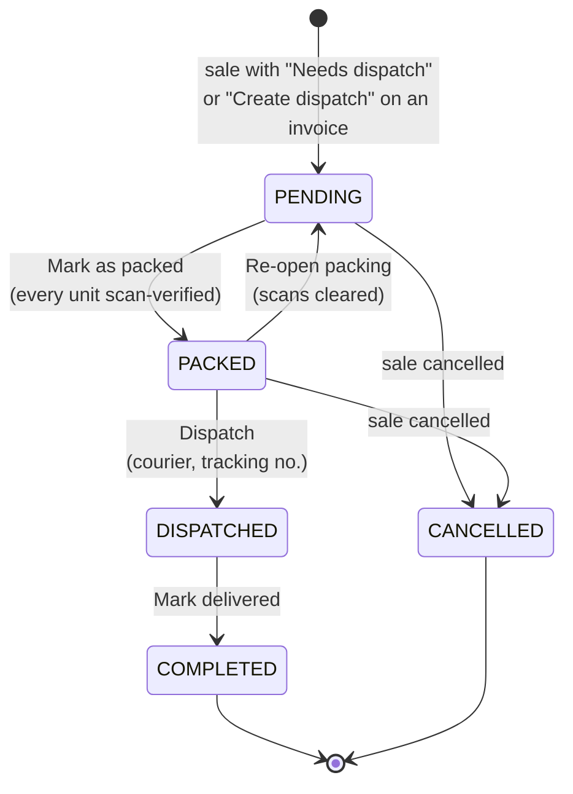
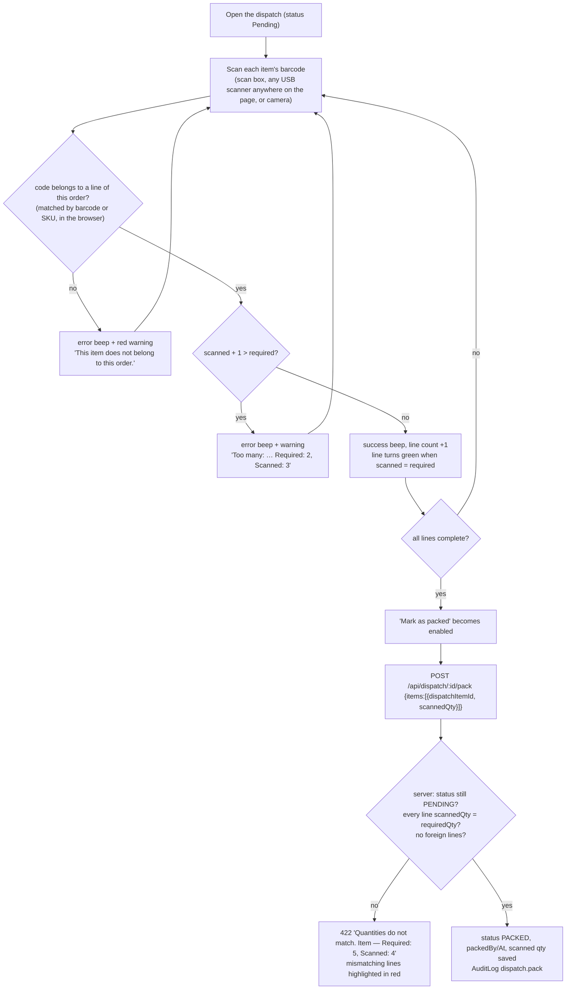

# Dispatch

[← Back to index](README.md)

Files: `src/server/services/dispatch.service.ts`, `src/features/dispatch/*`, pages `src/app/(app)/dispatch/*`.

Dispatch tracks **fulfilment** of a sale that must be delivered. Stock was already deducted when the sale was confirmed; dispatch makes sure the right items, in the right quantities, leave the building.

## Status flow

| Status | Meaning | Who sees it as "pending" |
|---|---|---|
| **Pending** | Waiting to be packed | Dashboard "Pending dispatch" (Pending + Packed) |
| **Packed** | All items scanned and verified | Dashboard |
| **Dispatched** | Handed to courier/transport | |
| **Completed** | Delivered | |
| **Cancelled** | Sale was cancelled before dispatch | |

Rules tied to other modules:

* A sale whose dispatch is **Pending/Packed** can't be **returned**; cancel the sale instead.
* A sale whose dispatch is **Dispatched/Completed** can't be **cancelled**; process a return instead.
* Cancelling a sale moves its Pending/Packed dispatch to **Cancelled**.

## Creating a dispatch

* **From the POS:** tick *Needs dispatch / delivery* (customer or delivery address required). The dispatch is created in the same transaction as the sale.
* **From an invoice:** *Create dispatch* (`POST /api/dispatch`, `dispatch.manage`). The address defaults to the customer's.

`createDispatch()` checks the sale is **confirmed** and has **no dispatch yet** (one per sale; a unique constraint backs this up). It creates one dispatch line per sale line with `requiredQty = sold − already returned`, skipping fully returned lines ("All items on this sale were returned — nothing to dispatch"). Number `DSP-xxxxx`; audited.

## Scan-verified packing (`/dispatch/[id]`)

* Per-line **−** and **+** buttons let staff correct a count. *+* runs through the same check as a scan. *Reset scans* clears all counts.
* The page listens for keyboard-wedge scanners **anywhere** (`useScannerListener`: a burst of keys < 50 ms apart ending in Enter), so staff don't need to click into the box first.
* **The server re-verifies everything.** Even a hand-crafted API call with wrong counts is rejected (tested in E2E).
* The claim `UPDATE … WHERE status = 'PENDING'` prevents two packers from packing the same order twice.

## Shipping and delivery

| Action | Endpoint | Allowed from | Effect |
|---|---|---|---|
| **Dispatch** (courier, tracking/LR no.) | `POST /api/dispatch/:id/ship` | Packed | → Dispatched, saves carrier, tracking, `dispatchedBy/At` |
| **Mark delivered / completed** | `POST /api/dispatch/:id/complete` | Dispatched | → Completed, `completedAt` |
| **Re-open packing** | `POST /api/dispatch/:id/unpack` | Packed | → Pending, clears packed info (e.g. box must be repacked) |

Each transition uses a conditional update (`WHERE status IN (allowed)`). A wrong-order click gets **409** "Cannot mark DSP-… as completed — it is currently packed". Every transition is audited, and none is possible once the sale is cancelled.

## Screens

**List (`/dispatch`):** status tabs (All, Pending, Packed, Dispatched, Completed, Cancelled) with counts; search by dispatch number, invoice number or customer. Columns: dispatch, invoice, customer, created, lines, status, value.

**Detail:**

* Progress steps (1 Pending → 4 Completed).
* The items list with live `scanned / required` counts.
* A "Deliver to" card (customer, phone, address).
* Packed / dispatched / delivered info (who and when), and the courier form when packed.
* *Print packing slip* prints the item list and address.
