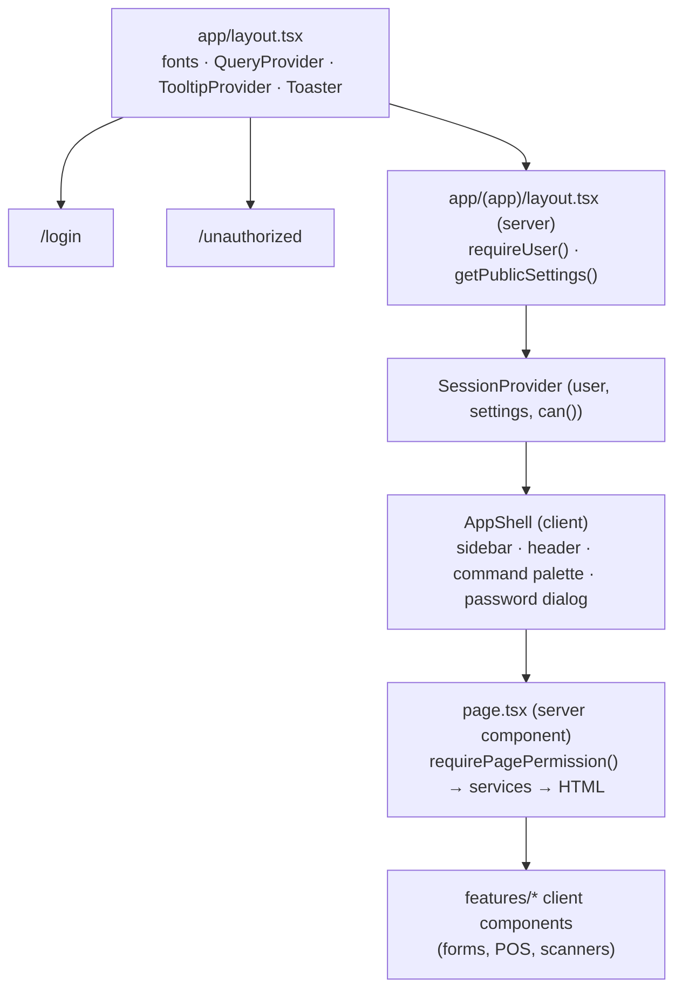
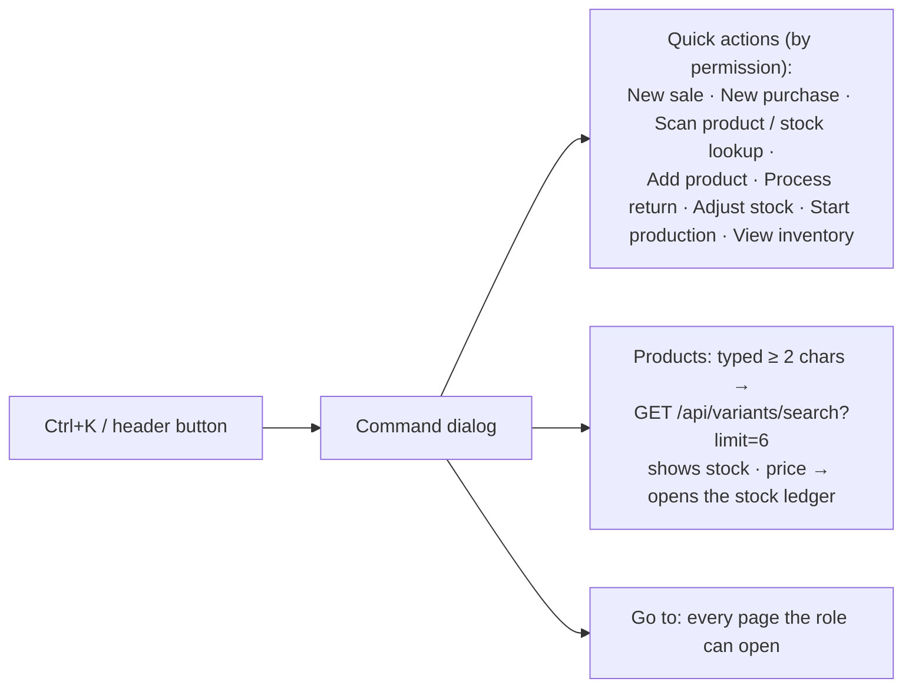
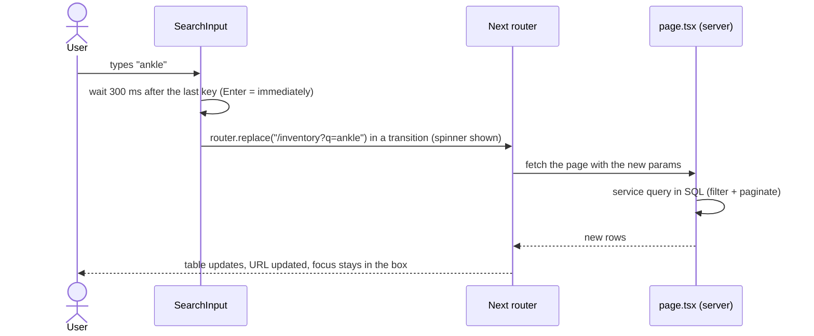
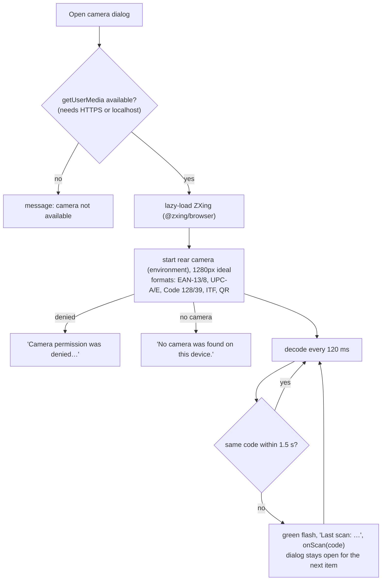

# Frontend

[← Back to index](README.md)

## Page structure



* **Server components** render every page with live data; there's no client-side data store for page data.
* **Client components** (`"use client"`) are used only where interaction is needed: forms, the POS, scanners, filters, dialogs.
* After a mutation, client components call `router.refresh()` (re-render the current page on the server) or `router.push()` to the new document.

## App shell (`components/layout/app-shell.tsx`)

* **Sidebar** (`nav.ts`), grouped:
  * Dashboard
  * Operations: Sales, Purchases, Dispatch, Returns
  * Stock: Inventory, Products, Manufacturing
  * Contacts: Suppliers, Customers
  * Insights: Reports, Audit log
  * Admin: Users, Settings

  Each item appears only if the role has its permission. The current section is highlighted (`aria-current="page"`). Below `lg` width the sidebar becomes a slide-in sheet opened by the ☰ button.
* **Header:** a *Quick actions & search* button (Ctrl K) and the account menu (name, role, *Change password*, *Sign out*).
* **Global shortcuts:** **Ctrl/⌘ + K** opens the command palette (except on the POS, where it focuses the scan box); **Alt + N** opens a new sale.

## Command palette (`components/layout/command-palette.tsx`)



Quick actions match on keywords too (e.g. "bill", "invoice", "grn", "damage").

## Talking to the API (`lib/api-client.ts`)

```ts
const sale = await api<{ id: string; number: string }>("/api/sales", { body: {...} });
```

* Sends JSON with `credentials: "same-origin"`; the method defaults to POST when there's a body.
* A network failure becomes `ApiError("Network error — please check your connection and try again.", "NETWORK")`.
* An error response becomes `ApiError(message, code, status, details)` with the server's safe message.
* **401** (session expired) sends the browser to `/login?next=<current page>`.
* `errorMessage(err)` gives the text for a toast. `newIdempotencyKey()` makes a UUID for document forms.

**TanStack Query** (`QueryProvider`) is used for search-as-you-type and previews: 15 s stale time, no refetch on window focus, at most 2 retries and never for 4xx errors. Previous results stay on screen while new ones load.

## Shared components (`components/shared/`)

| Component | What it does |
|---|---|
| `PageHeader` | Title, description, optional breadcrumbs and action buttons. Hidden when printing. |
| `SimpleTable` | Server-rendered table from column definitions; shows an empty state when there are no rows |
| `DataTable` | Client table (TanStack Table) with sortable columns over the current page (used by Inventory) |
| `Pagination` | Prev/Next links keeping all other URL filters; "1–25 of 340" |
| `SearchInput` | Search box bound to `?q=`. See [URL filters](#url-filters-search-filter-pagination). |
| `FilterSelect` | Dropdown bound to a URL parameter (resets to page 1) |
| `Toolbar` | Responsive row for search + filters |
| `StatusBadge` | Coloured badge for every status: stock (In/Low/Out), payment (Paid/Partial/Unpaid), sale, purchase, dispatch, return condition, active, product type |
| `StatCard` | Dashboard-style number card, optionally a link, with tones (warning/danger/success) |
| `EmptyState` / `ErrorState` | Friendly "nothing here yet" / "something went wrong + Try again". Usable from server and client components. |
| `ConfirmAction` | Button → confirmation dialog → POST, with an optional required reason; toasts the result and refreshes. Used for every irreversible action (receive, cancel, complete…). |
| `PrintButton` | `window.print()` |
| `Field` | Label + control + error/hint, wiring `id`, `aria-invalid` and `aria-describedby` for screen readers |
| `PageSkeleton` | Skeleton placeholders |
| `app-link` (`Link`) | Next.js `Link` with **automatic prefetch turned off**. Used everywhere instead of `next/link`. |

## URL filters (search, filter, pagination)

List pages keep their state in the URL (`?q=ankle&status=low&page=2`), so it can be bookmarked or shared and the back button works.



* Changing a search or filter **resets to page 1**.
* If text is typed before the page finished loading, `SearchInput` picks it up from the input once React is ready, so nothing typed is lost.

### Why there are no `loading.tsx` files and no prefetching

With Next.js 15.5, a route-level `loading.tsx` (global or per section) made same-page navigations intermittently **never complete**: a search typed on Products or a pagination click would silently do nothing. Removing every `loading.tsx` fixed it (measured: every navigation completes in ~170–500 ms). Pages render quickly on the server, search boxes show their own spinner, and charts/camera have their own skeletons. Automatic link prefetching is also off (`app-link.tsx`). Pages are per-user and dynamic, so prefetches only cost server renders. **Don't add `loading.tsx` back without re-running the search/navigation E2E tests** (`tests/e2e/search.spec.ts`).

## Error, empty and not-found states

| Situation | What renders |
|---|---|
| Page threw while loading | `app/(app)/error.tsx`: "Something went wrong while loading this page" + *Try again* (inside the app shell) |
| Record not found (`/sales/<bad id>`) | `app/(app)/not-found.tsx` (404) |
| Unknown URL | `app/not-found.tsx` |
| Missing permission | redirect to `/unauthorized` ("You don't have access to this page") |
| Root layout crash | `app/global-error.tsx` |
| List with no rows | `EmptyState` with a helpful action, e.g. "No purchases yet. Create your first purchase to start tracking inventory." When a search finds nothing: "No matches for 'xyz'". |
| Action failed | Toast with the server's message (long-lived for stock problems) |

## Barcode scanning components

### Keyboard-wedge scanners (USB / Bluetooth)

These scanners behave like a keyboard: they "type" the code very fast and press Enter.

* **Into an input** (POS scan box, product search boxes, dispatch scan box): Enter triggers an exact lookup.
* **Anywhere on a page** (dispatch packing): `hooks/use-scanner-listener.ts` listens for a burst of printable keys arriving **less than 50 ms apart** and ending in Enter (≥ 3 chars). Human typing is slower, so it's ignored; key presses inside text fields are left alone.
* `normalizeScan()` removes control characters some scanners append (CR, LF, tab) and trims spaces.

### Camera (`components/scanner/camera-scanner.tsx`)



Closing the dialog stops the camera. The decoder code isn't downloaded until the camera is first opened.

### Product search-or-scan box (`components/scanner/product-search-box.tsx`)

Used in purchases, adjustments, BOMs, barcode registration and the inventory lookup.

* Typing shows a dropdown of matching variants (180 ms debounce, up to 12; optional finished-good/raw-material filter). It shows SKU, barcode, price (selling or purchase), stock and status.
* **Enter** first tries the exact barcode/SKU lookup. If there's no exact match it takes the highlighted dropdown item. If nothing matches, it shows "Product not found" with *Create product* / *Register barcode* links (for product managers).
* **↑/↓** move the highlight, **Esc** closes the dropdown.
* A wrong type (e.g. a finished good in a BOM's material box) shows a clear message instead of being added.
* A camera button opens the camera scanner.

### Sound feedback (`lib/feedback.ts`)

WebAudio tones with no audio files: a short high **beep** for a successful scan, and a low double **buzz** for errors (unknown code, wrong item, too many). It fails silently where audio isn't available.

## Formatting (`lib/format.ts`)

* Money: `Intl.NumberFormat("en-IN", currency)` from the exact 2-decimal string, e.g. ₹1,42,676.00.
* Quantities: Indian digit grouping, up to 3 decimals, no trailing zeros (`1.5`, `1,250`).
* Dates and times are always formatted **in the business timezone** passed from the server.
* Labels for ledger types, adjustment reasons, dispatch statuses and payment modes are defined here.

## Printing

Global print CSS (`globals.css`): A4 page with 12 mm margins. Elements marked `.no-print` (sidebar, header, page headers, buttons, toasts) are hidden, and `.print-area` blocks lose their card styling. Printable screens: invoice, purchase, return note, dispatch packing slip, barcode labels.

## Responsiveness & accessibility

* Desktop-first layouts that collapse on tablets and phones:
  * The sidebar becomes a sheet and toolbars stack.
  * The POS cart becomes a slide-in panel with a bottom total bar.
  * Wide tables scroll horizontally inside their card.
  * Tested at 390 px with no page-level horizontal scroll.
* shadcn/Radix primitives provide keyboard navigation and focus management for dialogs, sheets, menus, selects and comboboxes.
* Form fields have labels and error descriptions; icon-only buttons have `aria-label`s; search results use `role="listbox"`/`option`; status changes use `role="alert"` or `aria-live`.
