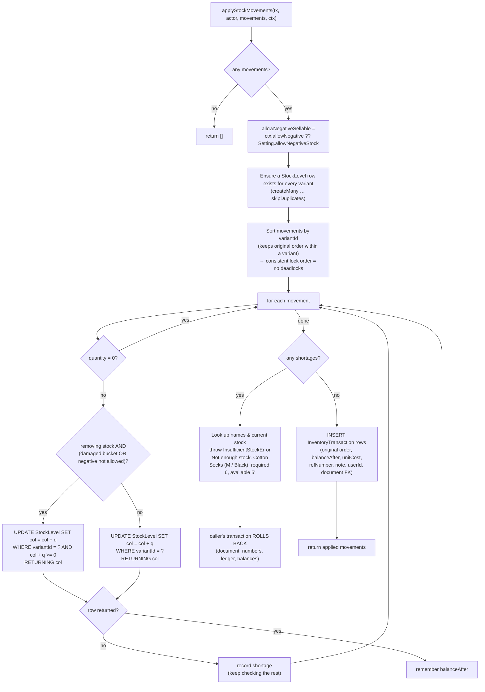
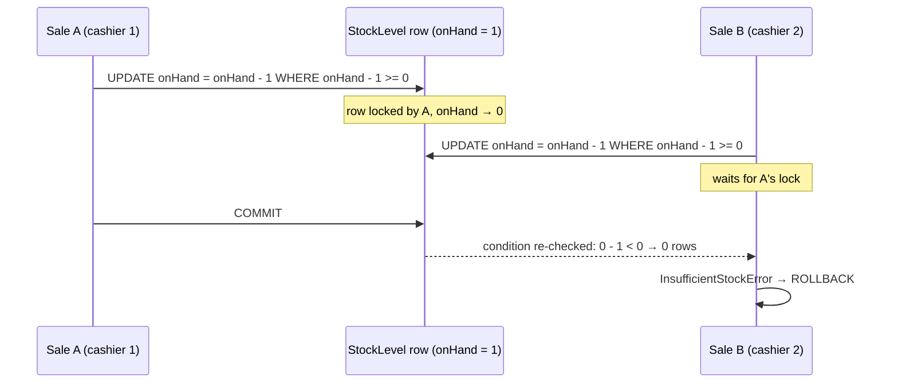
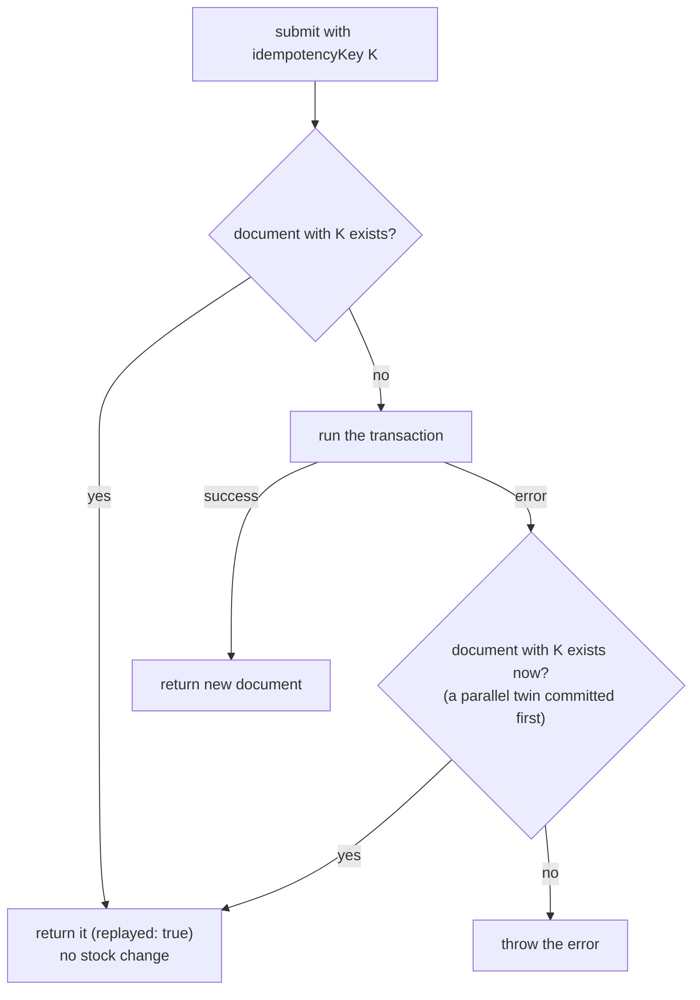
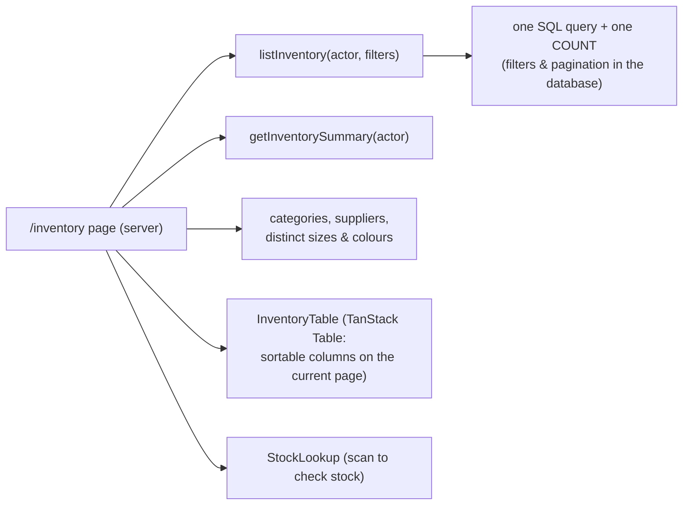

# Inventory engine

[← Back to index](README.md)

File: `src/server/services/inventory.service.ts`. Pages: `/inventory`, `/inventory/[variantId]`. See also [Stock adjustments](stock-adjustments.md).

This is the heart of the ERP. Stock is **never a number someone edits**. It's the running total of controlled movements, each recorded in the ledger.

## The two tables

| Table | Role |
|---|---|
| `InventoryTransaction` (the **ledger**) | Append-only history. One row per movement: variant, type, bucket, signed quantity, **balance after**, unit cost, reference number, user, time, and a foreign key to the document that caused it. |
| `StockLevel` (the **balance**) | One row per variant with `onHand` (sellable) and `damaged`. A cache of the ledger totals, written only by the engine, in the same transaction as the ledger row. |

Invariant (tested; also checked by `verifyLedgerIntegrity()`):

```text
StockLevel.onHand  = SUM(InventoryTransaction.quantity WHERE bucket = SELLABLE)
StockLevel.damaged = SUM(InventoryTransaction.quantity WHERE bucket = DAMAGED)
```

## Every movement, by document

| Document / action | Ledger type | Bucket | Effect | Notes |
|---|---|---|---|---|
| New product/variant with opening stock | `OPENING` | Sellable | **+** qty | Reference `OPN-xxxxx`, cost = variant cost price |
| Purchase received | `PURCHASE` | Sellable | **+** qty | Cost = line total ÷ qty. Also updates variant cost price to the latest rate. |
| Purchase cancelled | `PURCHASE_CANCEL` | Sellable | **−** (qty − already returned) | Never allowed to go negative |
| Sale confirmed | `SALE` | Sellable | **−** qty | Cost = variant cost price at sale time. Negative only if the setting allows. |
| Sale cancelled | `SALE_CANCEL` | Sellable | **+** qty | |
| Customer return: **good** | `CUSTOMER_RETURN` | Sellable | **+** qty | |
| Customer return: **damaged** | `CUSTOMER_RETURN` | **Damaged** | **+** qty | Sellable unchanged |
| Return to supplier | `SUPPLIER_RETURN` | Sellable *or* Damaged (user's choice) | **−** qty | Never negative |
| Adjustment: Damage | `ADJUSTMENT` | Sellable **−** and Damaged **+** | moves stock between buckets | Two ledger rows |
| Adjustment: Write off damaged | `ADJUSTMENT` | Damaged | **−** qty | |
| Adjustment: Lost | `ADJUSTMENT` | Sellable | **−** qty | |
| Adjustment: Found | `ADJUSTMENT` | Sellable | **+** qty | |
| Adjustment: Correction / Other | `ADJUSTMENT` | Sellable | **±** (chosen per line) | |
| Production: raw materials | `PRODUCTION_CONSUME` | Sellable (raw material) | **−** required qty | Never negative |
| Production: finished goods | `PRODUCTION_OUTPUT` | Sellable (finished good) | **+** qty | Cost = total material cost ÷ qty |
| Production cancelled | `PRODUCTION_CANCEL` | Sellable | finished **−**, raw **+** | Fails if output already sold |

## `applyStockMovements(tx, actor, movements, ctx)`

The **only** function that changes stock. Every service passes its own transaction `tx`, so the movement commits or rolls back with the document.

Input:

* `movements[]`: `{ variantId, quantity (signed), bucket?, type, unitCost?, note? }`
* `ctx.refNumber`: the document number shown in the ledger (e.g. `INV-00042`)
* `ctx.links`: the document foreign key, e.g. `{ saleId }`
* `ctx.allowNegative?`: override the setting (`false` for adjustments, supplier returns, purchase/production cancel, production)
* `ctx.shortagePrefix?`: wording of the error, e.g. "Cannot complete production"



### Why the conditional `UPDATE` matters

`UPDATE … WHERE onHand + q >= 0` does three things in **one statement**:

1. **Locks the row.** PostgreSQL takes a row lock, so a second transaction touching the same variant waits until the first commits or rolls back.
2. **Re-checks availability after the wait.** When the waiting transaction continues, it evaluates the condition against the *committed* balance.
3. **Returns the new balance.** That value goes into the ledger row as `balanceAfter`.

So two cashiers selling the last unit at the same moment can't both succeed:



The integration test *"concurrent sales cannot oversell"* fires 8 parallel sales at 5 units. Exactly 5 succeed, and the ledger still balances.

### Damaged stock is never negative

For the `DAMAGED` bucket the guard always applies, whatever the setting. A CHECK constraint (`damaged >= 0`) backs it up.

### The "allow negative stock" setting

`Setting.allowNegativeStock` (off by default, in **Settings → Stock rules**) affects **sales only**. When on, a sale can take sellable stock below zero, which shows as *Out of stock*. Adjustments, supplier returns, production and cancellations always pass `allowNegative: false`.

## Idempotency: no double posting

Every document form creates a random key once (`newIdempotencyKey()`) and sends it with the submit. Services wrap their transaction in `idempotent(key, findExisting, run)` (`src/server/idempotency.ts`):



* The key is stored in a **UNIQUE** column on the document (`Sale.idempotencyKey`, `Purchase…`, `CustomerReturn…`, `SupplierReturn…`, `StockAdjustment…`, `Production…`).
* If two identical requests race, the loser fails on the unique constraint or a stock check. It then finds the winner's document and returns that instead of an error.
* Covers double-clicking Confirm, network retries, and refreshing the page then resubmitting.
* After a successful sale or return the screen generates a **new** key for the next document.

## Stock status

`stockStatus(onHand, minStock, reorderLevel)` in `lib/calculations.ts`:

```text
threshold = max(minStock, reorderLevel)
onHand ≤ 0                          → OUT_OF_STOCK
threshold > 0 and onHand ≤ threshold → LOW_STOCK
otherwise                            → IN_STOCK
```

The same rule runs in SQL for the inventory filters and the dashboard counts.

## Inventory screen (`/inventory`)



**Summary cards:** active variants, low stock, out of stock, stock value at cost (admin only; `Σ max(onHand,0) × purchasePrice`), damaged units.

**Filters** (all in the URL, so a filtered view can be bookmarked):

| Filter | Rule |
|---|---|
| `q` (search) | Split into up to 6 words; **every** word must match. Words of 1–2 characters (e.g. `M`, `XL`) match size, colour or SKU **exactly**. Longer words match product name, code, SKU, colour or brand (contains), size (exact) or barcode (exact). So `ankle black m` finds Ankle Socks, black, size M. |
| `status` | `in`, `low`, `out`, `damaged` (has damaged stock), computed in SQL |
| `type` | finished goods / raw materials |
| `category` | product category **or** subcategory |
| `size`, `color` | exact (case-insensitive) |
| `supplier` | product's preferred supplier |
| `page` | 25 rows per page |

Only active products and variants are listed. The value column is shown only to roles with `dashboard.financials`.

**Quick stock lookup:** scan any barcode (or open `/inventory?scan=1` from Quick actions) to see a card with available, damaged, price, status and a link to the ledger. It uses the same exact lookup as the POS.

## Stock ledger (`/inventory/[variantId]`)

* Header cards: sellable, damaged, min/reorder, status + price.
* Table, newest first, 50 per page: **Date, Transaction, Reference, In, Out, Balance, User, Note**.
* The reference links to its document (sale, purchase, return, production).
* Filter **Sellable only / Damaged only**.
* Buttons: *View product*, *Adjust* (opens the adjustment form pre-filled with this variant).

Example of what the ledger shows:

| Date | Transaction | Reference | In | Out | Balance |
|---|---|---|--:|--:|--:|
| 10 Oct | Opening stock | OPN-00001 | +100 | | 100 |
| 11 Oct | Purchase | PUR-00023 | +200 | | 300 |
| 11 Oct | Sale | INV-02001 | | −20 | 280 |
| 12 Oct | Customer return | RET-00302 | +5 | | 285 |
| 12 Oct | Adjustment (damage) | ADJ-00004 | | −2 | 283 |

## Integrity check

`verifyLedgerIntegrity()` recomputes every balance from the ledger and returns the variants whose cached balance differs. It should always return an empty list. It's asserted:

* at the end of the seed (the seed aborts if anything is off);
* in the concurrency and returns integration tests.

To check a live database by hand:

```sql
WITH l AS (SELECT "variantId", bucket::text b, SUM(quantity) t FROM "InventoryTransaction" GROUP BY 1,2),
     c AS (SELECT "variantId", 'SELLABLE' b, "onHand" v FROM "StockLevel"
           UNION ALL SELECT "variantId", 'DAMAGED', damaged FROM "StockLevel")
SELECT * FROM c LEFT JOIN l USING ("variantId", b) WHERE c.v <> COALESCE(l.t, 0);
```

## Other helpers in this file

| Function | Purpose |
|---|---|
| `getStockMap(db, variantIds)` | Read balances (0 if no row yet). Used by the production preview. |
| `getVariantLedger(actor, variantId, {page, pageSize, bucket})` | Ledger page data |
| `searchTokens(q)` | Splits search text into ≤ 6 words of ≤ 60 chars |
| `isShortToken(t)` | `t.length <= 2`, treated as an exact size/colour/SKU |
| `escapeLike(s)` | Escapes `%`, `_`, `\` so user text can't change the search pattern |
