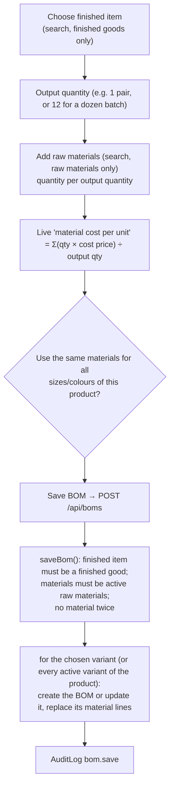
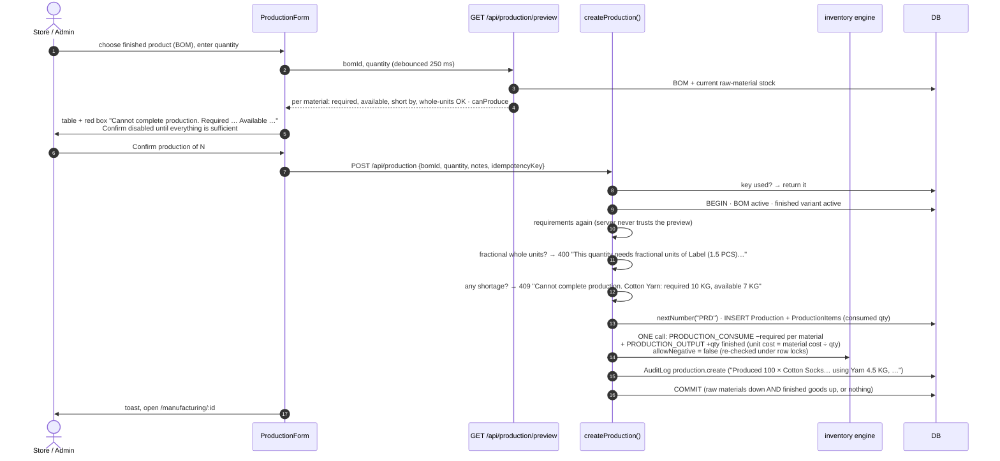

# Manufacturing

[← Back to index](README.md)

Files: `src/server/services/production.service.ts`, `src/features/manufacturing/*`, `src/lib/calculations.ts` (`requiredMaterial`), pages `src/app/(app)/manufacturing/*`.

Deliberately simple: **one bill of materials per finished variant**, and **one-step production** that consumes raw materials and adds finished goods in a single database transaction. No work orders, routings or scheduling.

## Concepts

* **Raw materials** are ordinary products of type *Raw material* (yarn in KG, elastic, labels, packaging in PCS…). They're bought through purchases and tracked in the same inventory ledger. They can't be sold.
* **Finished goods** are products of type *Finished good* (socks, gloves…).
* **Bill of materials (BOM):** the raw materials needed to make **`outputQty`** units of one finished variant.

```text
Cotton Socks — M / Black, per 1 pair
  Combed Cotton Yarn 30s   0.045 kg
  Elastic Band (cuff)      1 pcs
  Woven Brand Label        1 pcs
  Packaging Pouch          1 pcs
```

## Creating or editing a BOM (`/manufacturing/boms/new`)



* Editing: Manufacturing → *Bills of materials* tab → *Edit* opens the same form pre-filled (`?variant=`).
* *Deactivate* (`DELETE /api/boms/:id`) hides a BOM from production without deleting history.
* Past production runs keep their own consumed quantities (`ProductionItem`), so editing a BOM never changes history.

## Running production (`/manufacturing/new`)



### Requirement maths

```text
required = round3( perOutputQty × productionQty ÷ outputQty )
```

* Example: 0.045 kg per pair × 200 pairs ÷ 1 = **9 kg** of yarn.
* **Whole-unit materials** (PCS, PAIR…) must come out as whole numbers. A BOM of "1 label per 2 pairs" can make 4 pairs (2 labels) but not 3 (1.5 labels). The preview shows "Needs whole pcs" and the server rejects it.
* **Never negative:** raw materials can't go below zero, whatever the negative-stock setting.
* **Concurrency:** two production runs competing for the same yarn can't both consume it. The conditional stock updates serialise them and the second fails cleanly (tested).
* **Duplicate posting:** the idempotency key stops a double-clicked *Confirm* from producing twice (tested).

### Cost of finished goods

`unitCost` on the `PRODUCTION_OUTPUT` ledger row = Σ (material cost price × required) ÷ quantity produced. Example: 0.045 kg × ₹310 + ₹1.20 + ₹0.60 + ₹1.50 ≈ ₹17.25 per pair. The production report also shows raw-material cost at current cost prices.

## Cancelling a production run

Production page → *Cancel production* (admin, reason required) → `POST /api/production/:id/cancel`:

1. Claims the run (`COMPLETED` → `CANCELLED`, conditional update).
2. `PRODUCTION_CANCEL` movements: **−qty** of the finished goods and **+consumed** of each raw material.
3. Negative stock not allowed. If the produced goods were already sold, it fails: "Cannot cancel — the produced goods have already been sold or used".
4. Audit `production.cancel`.

## Screens

**Manufacturing (`/manufacturing`)** has three tabs:

| Tab | Shows |
|---|---|
| Production runs | Run number, date, finished goods, quantity produced, materials used, user, status |
| Bills of materials | Finished item, per quantity, materials list, material cost per unit, *Edit* / *Produce* |
| Raw materials stock | Every raw material with stock, minimum, cost per unit, status |

Header buttons: *New BOM*, *Add raw material* (opens the product form with type preset), *Start production*.

**Production detail (`/manufacturing/[id]`):** "+N produced" card and a "raw materials consumed" card (each linking to its ledger), notes, and the cancel button.

## Permissions

| Action | Admin | Store | Sales |
|---|:-:|:-:|:-:|
| View manufacturing, preview | ✔ | ✔ | |
| Create/edit/deactivate BOM | ✔ | | |
| Start production | ✔ | ✔ | |
| Cancel production | ✔ | | |
