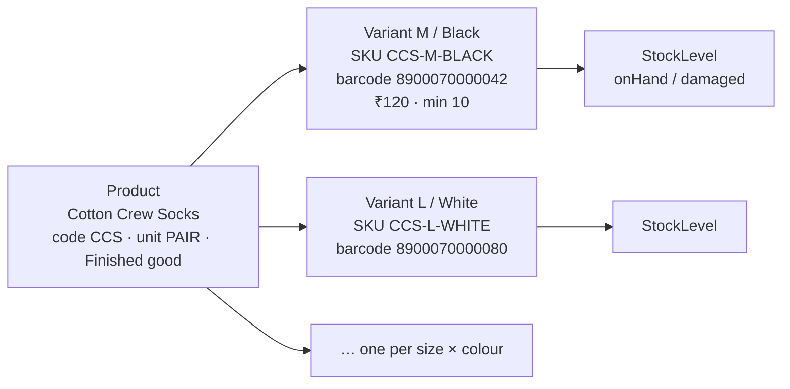
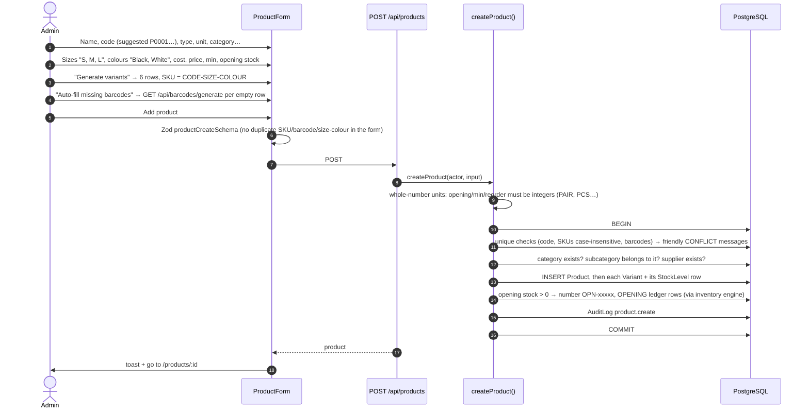
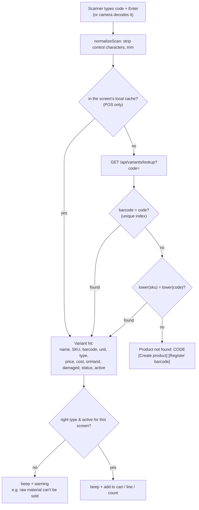
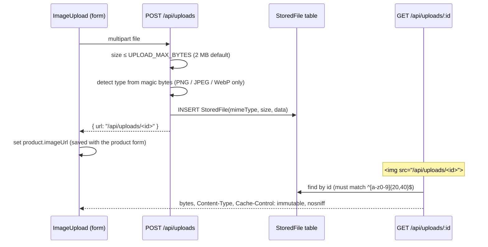

# Products & barcodes

[← Back to index](README.md)

Files: `src/server/services/product.service.ts`, `src/lib/barcode.ts`, `src/validators/masters.ts`, `src/features/products/*`, `src/components/scanner/*`, pages under `src/app/(app)/products/`, image routes `src/app/api/uploads/*`.

## Model: product → variants



* **Product** holds what's shared: name, code, type, category/subcategory, brand, unit, preferred supplier, description, image, active flag.
* **Variant** holds what differs: size, colour, SKU, barcode, cost price, selling price, minimum stock, reorder level, active flag.
* **Stock, sales, purchases and production are all per variant.** A product with one "default" variant (no size/colour) is normal for raw materials.
* **Type:** `FINISHED_GOOD` (can be sold and produced) or `RAW_MATERIAL` (can be purchased and consumed by production, never sold).

## Creating a product (`/products/new`)



Rules:

* **Product code:** 2–40 chars `A–Z 0–9 - _ .`, upper-cased, unique (case-insensitive). `/products/new` suggests the next free `P0001`-style code.
* **SKU:** 2–64 chars `A–Z 0–9 - _ . /`, upper-cased, unique (case-insensitive). The generator uses `buildSku(code, size, colour)`: each part is upper-cased, stripped to letters/digits and cut to 6 chars, e.g. `CS01-M-NAVYBL`.
* **Barcode:** optional, 3–64 chars `A–Z a–z 0–9 - _ .`, unique.
* **Prices:** cost price and selling price required (≥ 0, 2 decimals).
* **Opening stock** is posted to the ledger as an `OPENING` movement. The stock field itself can never be edited.
* Opening/visiting `/products/new?barcode=XXXX` pre-fills the first variant's barcode. That's the "Create product" link shown when a scan finds nothing.

### Editing

* **Product details** (`/products/[id]`, bottom form → `PATCH /api/products/:id`). The **unit** and **type** can't change once the product has any stock movement, because that would change the meaning of existing quantities. Deactivating is audited as `product.deactivate`.
* **Variants** (table at the top → edit drawer → `PATCH /api/variants/:id`): SKU, barcode, size, colour, prices, thresholds, active. Stock is read-only here, with a pointer to purchases/sales/adjustments. A **selling price change is audited** as `variant.price_change` ("Changed selling price of … from 100.00 to 120.00"); other edits as `variant.update` with a field-level diff.
* **Add variant** (drawer → `POST /api/products/:id/variants`): rejects a duplicate size + colour. Optional opening stock.
* **Inactive** products/variants stay in history but can't be sold, purchased or produced (`loadDocumentVariants` rejects them with "… is inactive and cannot be used in a sale").

## Barcodes

### Generating in-store barcodes

`generateInStoreEan13()` (`lib/barcode.ts`) builds **EAN-13** codes with prefix `21`:

```text
"21" + 10 digits + check digit
check digit = (10 − (Σ digit[i] × (i even ? 1 : 3)) mod 10) mod 10
```

GS1 reserves prefixes 20–29 for in-store use, so these never collide with manufacturers' barcodes. `generateUniqueBarcode()` retries up to 10 times until the code is unused. Endpoint: `GET /api/barcodes/generate` (admin).

### Scanning → product (exact lookup)



* The lookup is two indexed exact matches, which is very fast even for large catalogues.
* "Create product" and "Register barcode" links appear only for users with `products.manage`.

### Registering an unknown barcode

`/products/register-barcode?barcode=XXXX` (`RegisterBarcode` → `POST /api/variants/:id/barcode`): search the product the code belongs to, select the variant and save. The service normalises the code, checks the format, checks it isn't used elsewhere, and audits `variant.barcode` with old → new.

### Printing labels

`/products/[id]/labels` (`BarcodeLabels`): choose how many labels per variant (0–200, default 1 for variants with a barcode). Each label shows product name, size/colour, the barcode and the price. JsBarcode renders **EAN-13** when the code is 13 digits, otherwise **Code 128**. *Print* uses the browser print dialog; the print stylesheet hides everything except the label grid.

## Searching products

Two kinds of search:

| Where | Function | Behaviour |
|---|---|---|
| Product list `/products` | `listProducts()` | Each word must match name, code or brand (contains) **or** any variant's SKU (contains) or barcode (exact). Filters: type, category (or subcategory), status (active / inactive / all). 25 per page. Shows variants count, total stock, price range. |
| POS grid, search boxes, quick actions | `searchVariants()` via `GET /api/variants/search` | Returns **variants**. Each word must match. Short words (1–2 chars, e.g. `M`, `XL`) must equal size, colour or SKU. Longer words match product name/code/brand/SKU/colour (contains), size (exact) or barcode (exact). Active only (unless `includeInactive=1`). Optional `type`. Up to 50 results. Exact SKU/barcode matches are sorted first, then by name, size, colour. |

The short-word rule keeps searches predictable: `cotton l` means size L, not "every product containing the letter l".

## Product images



Images live in the database, so they survive on serverless hosting (Vercel) with no file storage service. Viewing them requires a signed-in session (the middleware gate).

## Categories

* Two levels: top-level categories (e.g. *Socks*) and subcategories (*Ankle socks*). Subcategories can't nest further.
* Names are unique per parent (case-insensitive).
* `GET /api/categories` (list), `POST /api/categories` (create, audited). The product form only offers subcategories of the chosen category, and the server re-checks that the subcategory belongs to it.

## Validation summary

| Check | Where |
|---|---|
| Field formats (code, SKU, barcode, prices, thresholds) | Zod `productCreateSchema`, `variantInputSchema` |
| No duplicate SKU / barcode / size-colour within the form | Zod `superRefine` |
| Unique code / SKU / barcode across the database | `assertUniqueCodes()` with friendly messages (backed by DB unique indexes) |
| Whole-number units | `checkVariantQuantities()` → `validateQuantityForUnit()` |
| Subcategory belongs to category | `assertCategory()` |
| Unit/type locked after stock movements | `updateProduct()` |
