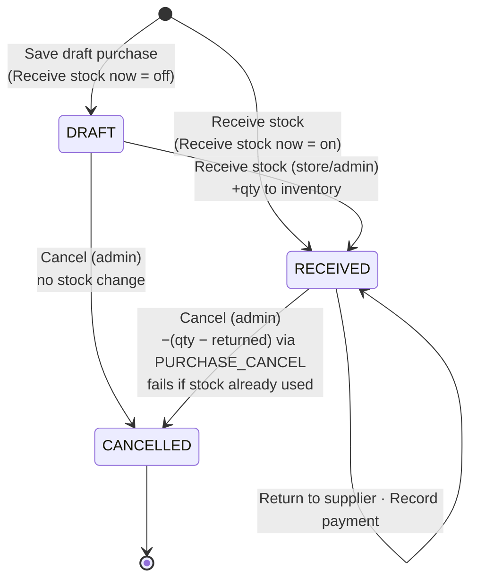
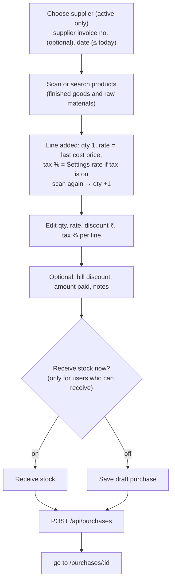
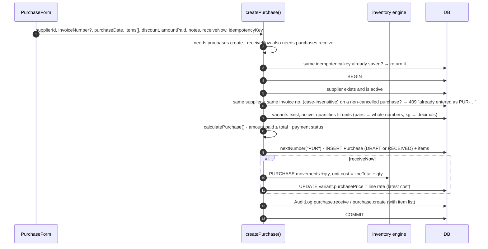
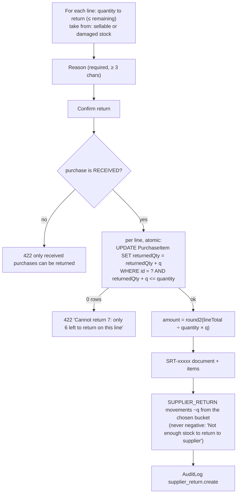

# Purchases & supplier returns

[← Back to index](README.md)

Files: `src/server/services/purchase.service.ts`, `src/features/purchases/*`, `src/validators/transactions.ts` (`purchaseCreateSchema`, `supplierReturnSchema`), pages `src/app/(app)/purchases/*`.

## Purchase life cycle



**Stock increases only when a purchase is received.** A draft is just an order.

## Creating a purchase (`/purchases/new`)



The form shows each line's amount and the totals live (same calculation as the server). The submit button stays disabled until a supplier is chosen and every line is valid. One idempotency key per form prevents double posting.

### Totals: `calculatePurchase()`

```text
per line:  gross = round2(qty × rate)
           base  = gross − discount            (0 ≤ discount ≤ gross)
           tax   = round2(base × taxRate / 100)
           lineTotal = base + tax
subtotal  = Σ base
taxAmount = Σ tax
total     = subtotal + taxAmount − bill discount   (bill discount ≤ subtotal + tax)
```

### Server: `createPurchase(actor, input)`



Notes:

* The **purchase date** is stored as midnight of that day in the business timezone.
* **Receiving updates the variant's cost price** to the purchase rate, which keeps stock valuation and margins current.
* **Duplicate supplier invoices** are blocked only against non-cancelled purchases. If you cancel a wrong entry, you can enter the same supplier invoice again.

## Receiving a draft

Purchase page → **Receive stock** (confirmation) → `POST /api/purchases/:id/receive` → `receivePurchase()`:

1. `UPDATE Purchase SET status = RECEIVED, receivedBy, receivedAt WHERE id = ? AND status = DRAFT`. This **claims** the draft atomically: if two people click at once, only one update changes a row. The other gets "has already been received". A cancelled draft gets "is cancelled".
2. Re-checks that the variants are still active and the quantities are valid.
3. Posts `PURCHASE` movements and refreshes cost prices, exactly like receive-on-create.
4. Audit `purchase.receive`.

## Cancelling

`POST /api/purchases/:id/cancel` with a reason (admin) → `cancelPurchase()`:

* Claims the purchase with a conditional update (`DRAFT` or `RECEIVED` → `CANCELLED`, recording time and reason).
* **Draft:** nothing else changes.
* **Received:** posts `PURCHASE_CANCEL` movements of `−(quantity − already returned to supplier)` per line, with negative stock **never allowed**. If some of that stock was already sold or consumed, the whole cancellation fails: "Cannot cancel — some of this stock has already been used or sold. …: required 10, available 2". The purchase stays received.
* Audit `purchase.cancel`.

## Paying the supplier

* **Amount paid** can be entered when creating the purchase.
* **Record payment** on the purchase page (`POST /api/purchases/:id/payment`, `purchases.create`) adds a payment. It must not exceed the balance payable and can't be made on a cancelled purchase.
* Status becomes **Paid**, **Partially paid** or **Unpaid**. Supplier pages and the purchase report show outstanding payables.

## Returning goods to a supplier

Purchase page (received purchases) → **Return to supplier** drawer → `POST /api/supplier-returns` → `createSupplierReturn()`.



* Returning **damaged** stock lets you send back defective goods you'd moved to the damaged bucket (via a damaged customer return or a damage adjustment).
* The purchase line's `returnedQty` limits future returns (also enforced by a CHECK constraint) and reduces the quantity a later cancellation reverses.
* Idempotent, like every document.

## Purchase pages

**List (`/purchases`):** search by purchase number, supplier invoice or supplier name. Filters: status, supplier. Columns: number, date, supplier, supplier invoice, lines, status + payment badges, total.

**Detail (`/purchases/[id]`):**

* Header: number, status, supplier, invoice, date.
* Actions (each only when allowed): *Print*, *Receive stock*, *Return to supplier*, *Record payment*, *Cancel purchase*.
* Items table: product, size/colour · SKU, "(returned N)", quantity + unit, rate, discount, tax, amount.
* Totals card: subtotal, tax, discount, total, paid, balance payable, payment status.
* Who created and received it, and when; notes.
* Returns to supplier list (number, reason, user, amount).
* A cancelled purchase shows when and why.
