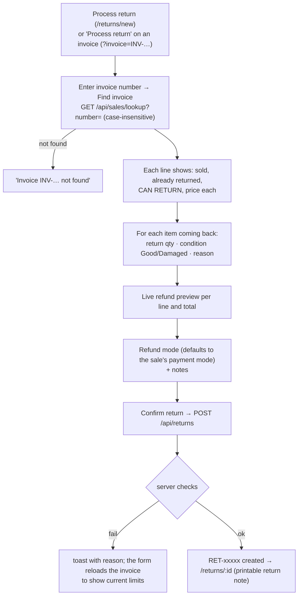
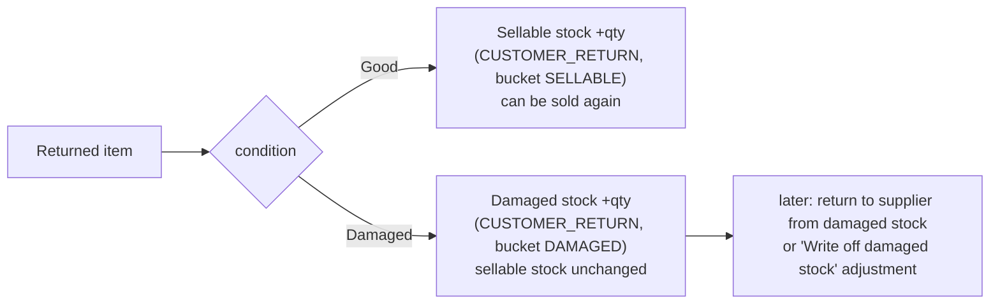
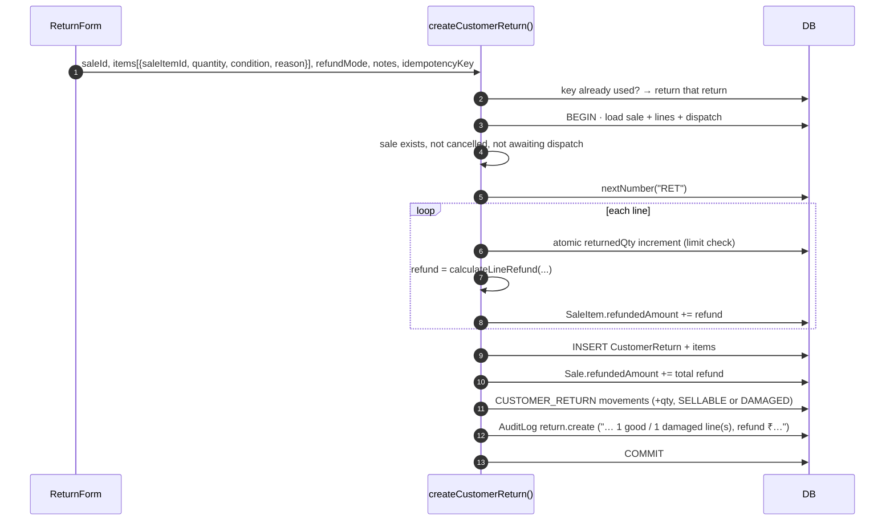

# Customer returns

[← Back to index](README.md)

Files: `src/server/services/return.service.ts`, `src/features/returns/return-form.tsx`, `src/lib/calculations.ts` (`calculateLineRefund`, `maxReturnable`), pages `src/app/(app)/returns/*`.

A return is **a separate document linked to the original invoice**. The sale is never deleted or rewritten; only its "returned" and "refunded" counters go up.

## End to end



## Where the stock goes



## The return limit

You can never return more than **sold − already returned** per invoice line:

```text
Sold = 10, already returned = 3  →  maximum additional return = 7
A request for 8 is rejected; 7 is accepted; after that the maximum is 0.
```

It's enforced in three places:

1. **Form:** shows "Maximum additional return is N" and disables *Confirm* when exceeded.
2. **Service:** an atomic conditional update per line:

   ```sql
   UPDATE "SaleItem" SET "returnedQty" = "returnedQty" + $q
   WHERE "id" = $line AND "returnedQty" + $q <= "quantity"
   RETURNING "quantity", "returnedQty", "netAmount", "refundedAmount";
   ```

   No row returned means the limit would be exceeded. The return fails with *"Cotton Socks (M / Black): sold 10, already returned 3 — maximum additional return is 7"*, and the whole return rolls back. Because the check and the increment are one statement under a row lock, **two returns submitted at the same time can't both pass**. The test "concurrent over-limit" proves only one succeeds.
3. **Database:** CHECK `0 ≤ returnedQty ≤ quantity`.

**Duplicate returns** (double-click, refresh) are prevented by the idempotency key. See [Inventory engine](inventory-engine.md#idempotency-no-double-posting).

## Other rules

| Rule | Message |
|---|---|
| Invoice must exist | "Invoice not found" |
| Cancelled invoices can't be returned | "Invoice INV-… is cancelled and cannot be returned" |
| Undispatched delivery orders (dispatch Pending/Packed) | "This order has not been dispatched yet. Cancel the sale instead of returning it." |
| The line must belong to the invoice | "Item does not belong to this invoice" |
| Whole-number units | "Quantity must be a whole number for unit PAIR" |
| Reason required | (form) "Select a reason" |

Reasons offered: *Size issue, Color mismatch, Defective / torn, Wrong item, Customer changed mind, Other*.

## Refund calculation

Each sale line stores `netAmount`: its share of the **final** invoice total, after line discount, bill discount and tax (see [Sales → totals](sales-pos.md#how-totals-are-calculated)). Refunds are based on what the customer actually paid for that line:

```text
calculateLineRefund(sold, alreadyReturned, netAmount, alreadyRefunded, returnQty):
  remaining = sold − alreadyReturned
  if returnQty = remaining:  refund = netAmount − alreadyRefunded     ← exact remainder
  else:                      refund = round2(netAmount × returnQty ÷ sold)
```

The last return of a line gets the exact remainder, so **partial returns always add up to the amount charged**, never a paisa more. Example: a line of 3 pairs for ₹100.00 refunds 33.33 + 33.33 + 33.34. A CHECK constraint keeps `refundedAmount ≤ netAmount`.

The refund total is stored on the return and added to `Sale.refundedAmount`. **Refund mode** records how the money went back (Cash, UPI, Card, Bank, or Credit = adjusted against balance / credit note). The ERP records the refund; it doesn't move money.

## What the server does: `createCustomerReturn()`



## Where returns show up

| Place | What you see |
|---|---|
| Return note `/returns/[id]` | Items, quantity, condition, reason, refund each, total, refund mode. Printable. |
| Invoice `/sales/[id]` | "(returned N)" next to the line; returns card with links; refunded total |
| Customer page | Returns list and total refunds |
| Stock ledger | `Customer return` rows (Damaged rows marked) |
| Sales report | Returns count, quantity, value, and net sales |
| Audit log | `return.create` entries |
| Returns list `/returns` | Search by return number, invoice number or customer; good/damaged quantity badges, user, refund mode, amount |
