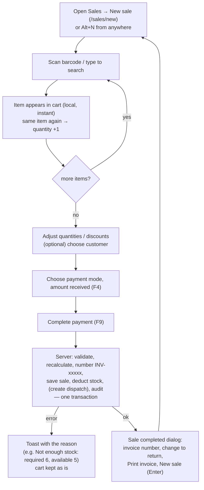
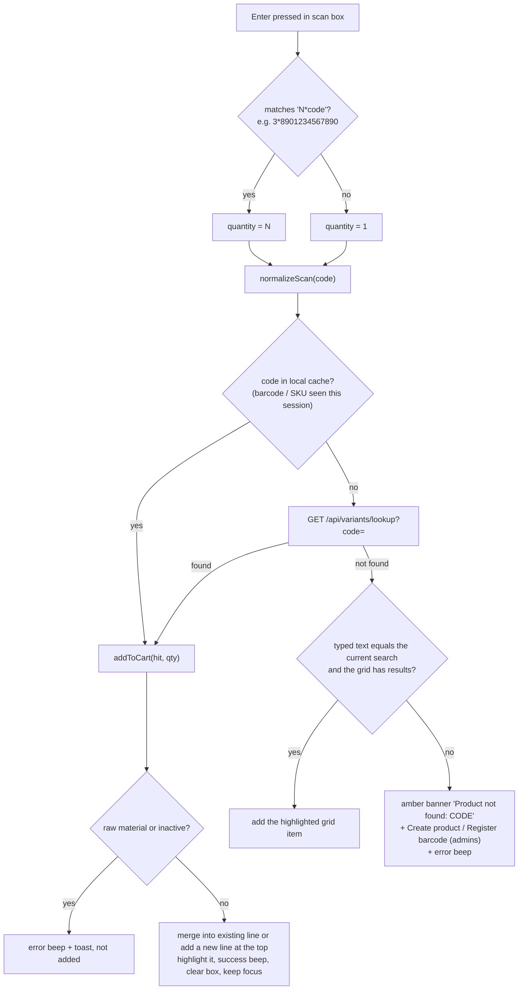
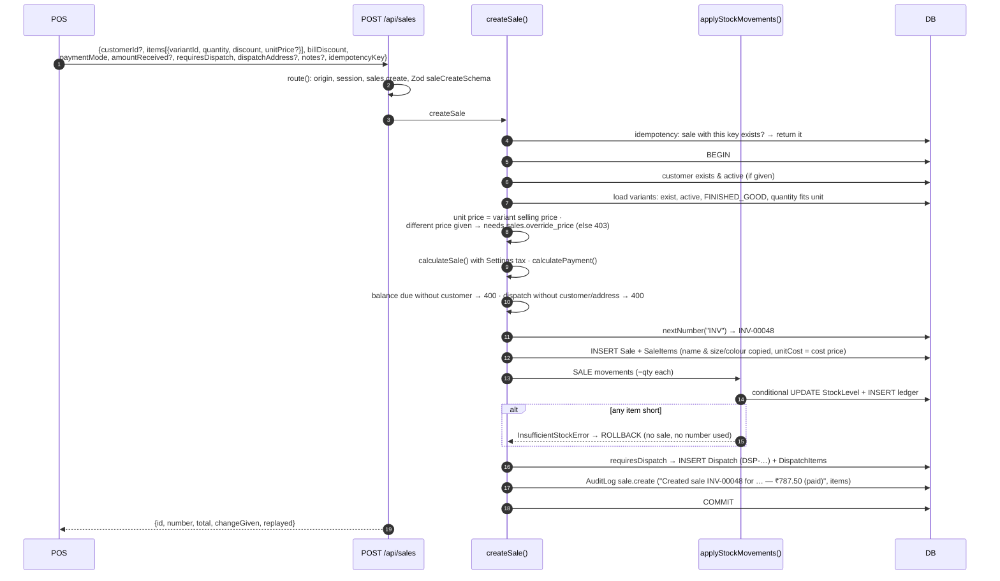
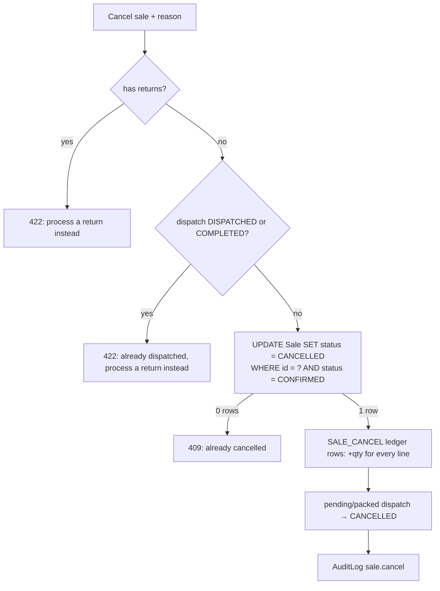

# Sales & POS

[← Back to index](README.md)

Files: `src/features/pos/pos-screen.tsx`, `src/features/pos/customer-picker.tsx`, `src/server/services/sale.service.ts`, `src/lib/calculations.ts`, `src/validators/transactions.ts` (`saleCreateSchema`), `src/features/sales/*`, pages `src/app/(app)/sales/*`.

## The whole sale, end to end



Stock is deducted **only when the server commits the sale**. Adding items to the cart reserves nothing.

## POS screen layout

```text
┌──────────────────────────────────────────────────────────────┐
│ [▮▮ Scan barcode, or type to search …]   [Camera]   F2 F4 F9 │
├───────────────────────────────────────┬──────────────────────┤
│ Product grid (search results)         │ Customer: Walk-in ▾  │
│ ┌────────┐ ┌────────┐ ┌────────┐      │ Cart lines           │
│ │Ankle   │ │Cotton  │ │Sports  │ …    │  qty [-][2][+] disc  │
│ │L/Black │ │M/Navy  │ │XL/White│      │ ───────────────────  │
│ │₹80  47 │ │₹120 45 │ │₹180 59 │      │ Items, discounts,    │
│ └────────┘ └────────┘ └────────┘      │ bill discount, GST   │
│                                       │ TOTAL                │
│                                       │ Cash UPI Card Credit │
│                                       │ Amount received      │
│                                       │ Change / balance due │
│                                       │ [ ] Needs dispatch   │
│                                       │ [Complete payment]   │
│                                       │ Hold · Held · Cancel │
└───────────────────────────────────────┴──────────────────────┘
```

On phones and small tablets the cart moves into a slide-in panel. A bottom bar shows the total and a *View cart & pay* button.

## Adding items

### By scanner (USB/Bluetooth, keyboard-wedge)

A scanner types the code and presses Enter into the focused scan box (it's focused on load and after every action).



The cache keeps repeated scans of the same barcode instant (no network call). It's cleared after each completed sale, so stock figures refresh.

### By search or touch

Typing filters the **product grid** (server search, 160 ms debounce, finished goods only, 24 results). Arrow keys move the highlight; Enter adds the highlighted item. Clicking or tapping a card adds it. Cards show price, stock left (amber when low, "Out" when zero) and a badge with the quantity already in the cart.

### By camera

*Camera* opens the camera scanner (ZXing, loaded on demand). It stays open for continuous scanning, flashes green on each read, and ignores the same code seen again within 1.5 s. See [Frontend → scanning](frontend.md#barcode-scanning-components).

## The cart

Each line: product name, size/colour (or SKU), unit price, line total, and:

* **Quantity**: −/+ buttons, typed value, ↑/↓ arrow keys; Enter returns focus to the scan box. Reaching 0 removes the line.
* **Discount**: a rupee amount for the line.
* **Price**: editable only for roles with `sales.override_price` (admin). The server rejects a changed price from anyone else.
* **Remove** (×).

Line warnings (the sale can't be completed until they're fixed):

* "Enter a quantity", "Whole numbers only" (e.g. pairs), "Invalid discount", "Invalid price".
* "Only X in stock" when the quantity exceeds cached stock, unless negative stock is allowed in Settings.

## How totals are calculated

The POS preview and the server use the **same function**, `calculateSale()` in `lib/calculations.ts`, with exact decimals:

```text
for each line:
  gross     = round2(quantity × unitPrice)
  discount  = line discount            (0 ≤ discount ≤ gross)
  lineTotal = gross − discount
subtotal    = Σ lineTotal
billDiscount                            (0 ≤ billDiscount ≤ subtotal)
taxable     = subtotal − billDiscount
taxAmount   = round2(taxable × taxRate / 100)    taxRate = Settings.taxRate if tax is enabled, else 0
total       = taxable + taxAmount
netAmount per line = allocate(total, lineTotals)
```

`allocate()` splits the total across lines in proportion to their line totals, rounded to paise, and puts any rounding remainder on the largest line. The line shares always add up **exactly** to the invoice total. `netAmount` is stored on each sale line and is what returns refund from. See [Customer returns](returns.md).

Worked example (GST 5 %):

| Line | Qty × Price | Discount | Line total |
|---|---|--:|--:|
| Cotton socks | 3 × 120 | 10 | 350.00 |
| Sports socks | 2 × 225 | 0 | 450.00 |
| **Subtotal** | | | **800.00** |
| Bill discount | | | −50.00 |
| Taxable | | | 750.00 |
| GST 5 % | | | 37.50 |
| **Total** | | | **787.50** |

## Payment rules

`calculatePayment(total, amountReceived, mode)`:

| Mode | Amount field empty means | Over-payment | Change returned |
|---|---|---|---|
| **Cash** | exact amount | allowed | `received − total` |
| **UPI / Card / Bank** | exact amount | **rejected** ("cannot exceed the total for non-cash payments") | never |
| **Credit** | nothing paid now (0) | allowed (treated as paid) | never |

* `amountPaid = min(received, total)`, `balanceDue = total − amountPaid`.
* `paymentStatus`: **PAID** if nothing is due, **PARTIAL** if something was paid, otherwise **UNPAID**.
* **A balance due needs a customer**: the server rejects a credit or part-paid walk-in sale ("Select a customer for credit or partially paid sales"). The POS shows the same hint before submitting.
* *Exact* fills the cash field with the total. Enter in the amount field completes the sale.

## Customer selection

`CustomerPicker`: a searchable popover (name or phone, `GET /api/customers?q=`, 200 ms debounce, active customers, 10 results).

* **Walk-in Customer** is the default and needs no record.
* **Add new customer** (users with `customers.manage`): a small dialog with name and phone. If you'd typed digits in the search, they pre-fill the phone. It saves through `POST /api/customers` and selects the new customer.
* Choosing a customer copies their address into the delivery address field (if empty).

## Delivery orders

*Needs dispatch / delivery* adds a delivery address box. A dispatch order requires either a customer or an address. The sale then creates a `Dispatch` (`DSP-xxxxx`, status **Pending**) in the same transaction. Stock is still deducted at sale time. See [Dispatch](dispatch.md).

## Completing the sale: server side

`POST /api/sales` → `createSale(actor, input)`:



What the POS does with the answer:

* **Success:** toast "Sale completed successfully", success dialog (invoice number, change to return, *Print invoice* opens `/sales/:id?print=1` in a new tab, *New sale* with Enter). The cart resets, the scan cache clears, and a new idempotency key is created.
* **Not enough stock:** a 10-second toast lists each short item, the cart's stock figures refresh (`POST /api/variants/by-ids`), and the cart is kept.
* **Any other error:** a toast with the server's message; the cart is kept. Retrying is safe because the same idempotency key is reused until a sale succeeds.

## Hold and restore carts

* **Hold** saves the current cart (lines + customer) to this browser's `localStorage` (`pos.heldCarts.v1`, up to 10) and starts a fresh sale.
* **Held carts** lists them. **Restore** holds the current cart first (if any), loads the chosen one, and refreshes its stock figures.
* Held carts **don't reserve stock** and exist only on that computer.

## Keyboard shortcuts (POS)

| Key | Action |
|---|---|
| **F2** or **Ctrl/⌘ + K** | Focus and select the scan/search box |
| **F4** | Go to payment (opens the cart panel on mobile, focuses the amount) |
| **F9** | Complete the sale |
| **Enter** (scan box) | Look up the code / add highlighted item |
| **↑ ↓ ← →** (scan box) | Move the highlight in the product grid |
| **↑ ↓** (quantity box) | Increase / decrease quantity |
| **Esc** | Clear the search box / close dialogs |
| **Alt + N** (anywhere in the app) | Open a new sale |

## Invoice page (`/sales/[id]`)

The invoice (`features/sales/invoice.tsx`) is printer-friendly (A4). The print stylesheet hides the sidebar, header, buttons and toasts. It shows:

* Business name, address, phone, email, GSTIN (from Settings).
* Title: **Tax invoice** (tax enabled), **Invoice**, or **Cancelled invoice**; number; date/time in the business timezone.
* Bill to (customer name, phone, address) and payment status + mode.
* Lines: #, product, size/colour · SKU, "(returned N)" if any, quantity + unit, rate, discount, amount.
* Gross amount, item discounts, bill discount, GST @ rate, **Total**, paid, change returned, balance due, refunded (returns).
* Notes and the invoice footer text from Settings.

`?print=1` opens the print dialog automatically after 0.4 s (used by the POS success dialog).

Actions on the page (each shown only when allowed):

| Button | Shown when | Does |
|---|---|---|
| Print invoice | always | browser print |
| Process return | confirmed sale, something left to return, user can return, dispatch not pending/packed | opens `/returns/new?invoice=INV-…` |
| Create dispatch | confirmed, no dispatch yet, `dispatch.manage` | `POST /api/dispatch` with an address, then opens the dispatch |
| Collect payment | balance due, `sales.create` | records a payment (see below) |
| Cancel sale | confirmed, no returns, not dispatched/completed, `sales.cancel` | confirmation dialog with required reason |

Side cards show the dispatch status and every return against the invoice (number, time, user, refund).

## Collecting an outstanding balance

`POST /api/sales/:id/payment` → `recordSalePayment()`:

1. The sale must exist, not be cancelled, and have a balance due.
2. The amount must be ≤ the balance.
3. A **conditional SQL update** adds the amount only if `amountPaid + amount ≤ total`. Two people collecting the same balance at once can't over-collect; the second gets "The balance changed. Please refresh."
4. Status becomes PAID or PARTIAL. Audited as `sale.payment`.

## Cancelling a sale

`POST /api/sales/:id/cancel` (reason required, admin only) → `cancelSale()`:



The invoice is **kept** and marked cancelled (who, when, why). The original `SALE` ledger rows stay, and the reversal rows restore stock, so the ledger history is complete.

## Sales list (`/sales`)

Search by invoice number, customer name or phone. Filters: date (today, yesterday, this week, this month, in the business timezone), payment status, sale status. Each row shows invoice, date/time, customer, line count, payment mode, badges (payment status or cancelled, number of returns, dispatch status) and total. 25 per page.
