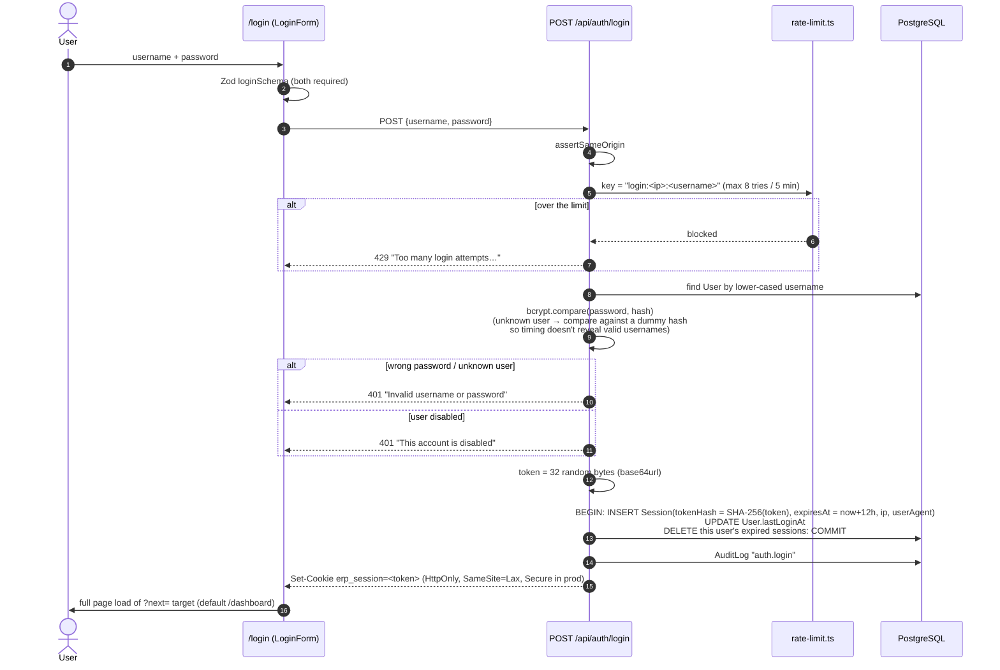
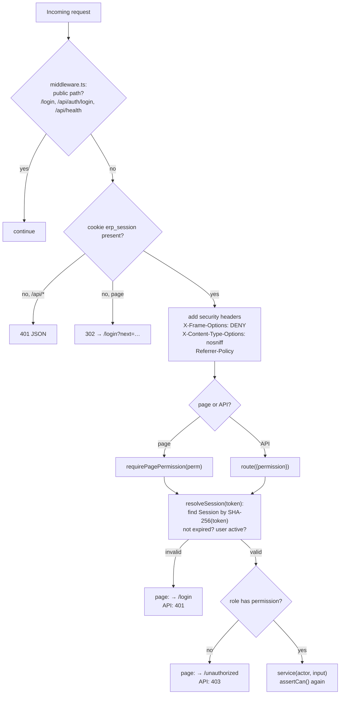

# Authentication, roles & permissions

[← Back to index](README.md)

Files: `src/middleware.ts`, `src/server/auth/*`, `src/server/services/auth.service.ts`, `src/server/services/user.service.ts`, `src/lib/permissions.ts`, `src/app/login/*`, `src/app/api/auth/*`.

## Sign-in flow

Key details:

* **Passwords** are hashed with **bcrypt (cost 10)** (`server/auth/password.ts`). Plain passwords are never stored or logged.
* **Only a hash of the session token is stored** (`Session.tokenHash` = SHA-256). A leaked database therefore can't be used to hijack sessions.
* **Session lifetime: 12 hours** (`SESSION_TTL_MS`), one working day. `lastSeenAt` is refreshed at most every 5 minutes.
* The cookie is `HttpOnly` (unreadable by JavaScript), `SameSite=Lax`, `Path=/`, and `Secure` in production unless `INSECURE_COOKIES=true` (only for plain-HTTP LAN installs).
* The `?next=` redirect is accepted only if it starts with `/` and not `//`, which blocks open redirects. If you're already signed in, `/login` redirects you away.
* On success the rate-limit bucket for that IP + username is cleared.

## How every request is authenticated

* The **middleware** is only a fast first gate: it checks that the cookie *exists*. Real validation (token hash lookup, expiry, active user) happens on the server for every page and API call.
* `getCurrentUser()` is wrapped in React `cache()`, so a page that calls it several times hits the database once.
* The `Actor` object (`{ id, name, username, role, ip }`) is built **only on the server** from the database. Nothing the browser sends can change the role.

## Roles and permissions

Permissions are defined in one place, `src/lib/permissions.ts`. Three roles exist:

* **ADMIN** (Owner): every permission.
* **STORE** (Store / Warehouse)
* **SALES** (Sales / Billing)

| Permission | Admin | Store | Sales | Used for |
|---|:-:|:-:|:-:|---|
| `dashboard.view` | ✔ | ✔ | ✔ | Dashboard |
| `dashboard.financials` | ✔ | | | Money values on dashboard, inventory value, supplier totals |
| `products.view` | ✔ | ✔ | ✔ | Product list, search, barcode lookup |
| `products.manage` | ✔ | | | Create/edit products & variants, barcodes, categories, image upload |
| `inventory.view` | ✔ | ✔ | ✔ | Inventory list, stock ledger |
| `inventory.adjust` | ✔ | ✔ | | Stock adjustments (damage, lost, found…) |
| `purchases.view` | ✔ | ✔ | | Purchase list/detail |
| `purchases.create` | ✔ | ✔ | | Create purchases, record supplier payments |
| `purchases.receive` | ✔ | ✔ | | Receive stock (draft → received, or receive on create) |
| `purchases.cancel` | ✔ | | | Cancel purchases |
| `supplier_returns.create` | ✔ | ✔ | | Return goods to supplier |
| `sales.view` | ✔ | ✔ | ✔ | Sales list, invoices, invoice lookup for returns |
| `sales.create` | ✔ | | ✔ | POS, collect outstanding payments |
| `sales.override_price` | ✔ | | | Change unit price in the POS |
| `sales.cancel` | ✔ | | | Cancel a sale |
| `dispatch.view` | ✔ | ✔ | ✔ | Dispatch list/detail |
| `dispatch.manage` | ✔ | ✔ | | Create dispatch, pack, ship, complete, re-open |
| `returns.view` | ✔ | ✔ | ✔ | Returns list/detail |
| `returns.create` | ✔ | ✔ | ✔ | Process customer returns |
| `manufacturing.view` | ✔ | ✔ | | Manufacturing pages, production preview |
| `manufacturing.manage_bom` | ✔ | | | Create/edit/deactivate BOMs |
| `manufacturing.produce` | ✔ | ✔ | | Start production |
| `manufacturing.cancel` | ✔ | | | Cancel a production run |
| `suppliers.view` | ✔ | ✔ | | Supplier list/detail |
| `suppliers.manage` | ✔ | | | Create/edit suppliers |
| `customers.view` | ✔ | ✔ | ✔ | Customer list/detail, POS customer search |
| `customers.manage` | ✔ | | ✔ | Create/edit customers (also from POS) |
| `reports.view` | ✔ | | | All reports and CSV exports |
| `audit.view` | ✔ | | | Audit log |
| `users.manage` | ✔ | | | Users page |
| `settings.manage` | ✔ | | | Business settings |

### Three layers of enforcement

1. **UI (hint only).** `SessionProvider` exposes `can(permission)` to client components. The sidebar, quick actions and buttons are hidden when the role lacks a permission. This is convenience, not security.
2. **Entry point.** Pages call `requirePagePermission()`; API routes declare `route({ permission })`.
3. **Service.** Every service function starts with `assertCan(actor, permission)`. Some rules need finer checks inside the service, for example:
   * `createPurchase` with `receiveNow: true` additionally requires `purchases.receive`.
   * `createSale` rejects a changed `unitPrice` unless the actor has `sales.override_price`.

The E2E security tests prove that calling the API directly with the wrong role returns 403 (see [Testing](testing.md)).

## Cross-site request protection

* The session cookie is `SameSite=Lax`, so other sites can't send it with POST requests.
* **Defence in depth:** `assertSameOrigin()` rejects mutating requests whose `Origin` header points to another site.

## Sign-out

`POST /api/auth/logout` deletes the session row whose hash matches the cookie, then clears the cookie. The browser then loads `/login`.

## Changing your own password

Account menu → **Change password** (`ChangePasswordDialog`) → `POST /api/auth/password`:

1. Verifies the current password with bcrypt (wrong → `VALIDATION` "Current password is incorrect").
2. Stores the new bcrypt hash (minimum 6 characters).
3. **Signs out all your other sessions** (deletes every session except the one making the request).
4. Writes an audit entry `user.password`.

## User management (admin)

`/users` → `UsersManager` → `POST /api/users` (create) and `PATCH /api/users/:id` (update). Rules in `user.service.ts`:

* Usernames are lower-case `a–z 0–9 . _ -` (3–40 chars) and unique. Emails are optional and unique.
* You can't deactivate yourself or remove your own admin role.
* The **last active admin** can't be demoted or deactivated ("At least one active admin is required").
* Changing a user's **role**, **deactivating** them or **resetting their password** deletes all their sessions immediately. The change takes effect on their next click.
* Deactivated users can't sign in ("This account is disabled"). Their history stays intact.
* Each change is audited, e.g. `Updated user priya: role SALES → STORE, password reset`.

## Rate limiting

`server/auth/rate-limit.ts` is an in-memory fixed-window limiter: **8 attempts per 5 minutes per IP + username**. It lives in the server process, so on multi-instance or serverless hosting each instance has its own counter. Put a shared store (e.g. Redis) behind it if that matters.

## Security checklist (what is protected and where)

| Threat | Protection |
|---|---|
| Plain-text passwords | bcrypt hashes only |
| Stolen session from DB dump | Only SHA-256 token hashes stored |
| Cookie theft via XSS | `HttpOnly` cookie; React escapes output |
| CSRF | `SameSite=Lax` + Origin check |
| Bypassing the UI | Server-side permission check on every page, route and service |
| Role tampering | Role comes from the database, never from the request |
| SQL injection | Prisma parameterised queries; raw SQL uses tagged templates (`$queryRaw\`...${value}\``) which are parameterised |
| Brute force | Login rate limit + constant-time dummy hash for unknown users |
| Clickjacking | `X-Frame-Options: DENY` |
| Malicious uploads | Image type detected from magic bytes (PNG/JPEG/WebP only), size limit, served with `nosniff` |
| Path traversal | Image IDs must match `^[a-z0-9]{20,40}$` |
| CSV formula injection | Cells starting with `= + - @` are prefixed with `'` (`lib/csv.ts`) |
| Leaking internals | `toAppError()` returns safe messages; stack traces only in server logs |
| Secrets in Git | `.env*` files ignored (except `.env.example`) |
