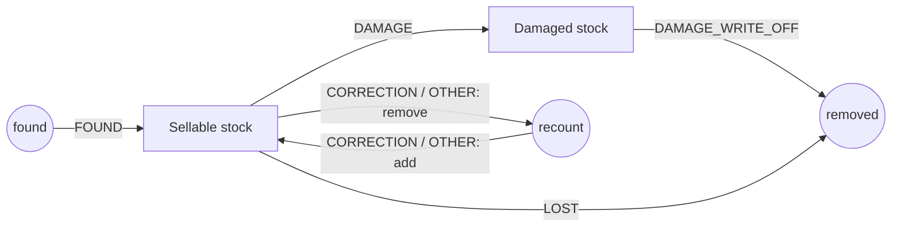
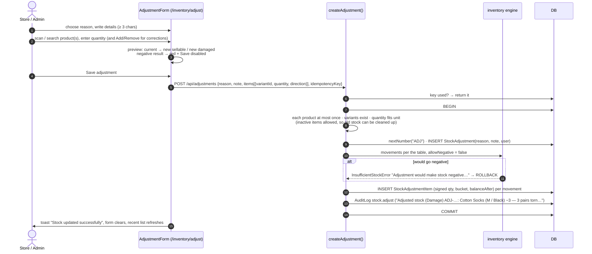

# Stock adjustments

[← Back to index](README.md)

Files: `src/server/services/adjustment.service.ts`, `src/features/inventory/adjustment-form.tsx`, page `src/app/(app)/inventory/adjust/page.tsx`. Permission: `inventory.adjust` (Admin, Store).

Adjustments are the **only** way to correct stock outside a business document. They're controlled: a reason and a written explanation are mandatory, every change is a ledger entry with the user and time, and stock can never go negative.

## Reasons and their effect

| Reason (`AdjustmentReason`) | Label in the form | Sellable | Damaged |
|---|---|:-:|:-:|
| `DAMAGE` | Damage (move to damaged stock) | **−q** | **+q** |
| `DAMAGE_WRITE_OFF` | Write off damaged stock | | **−q** |
| `LOST` | Lost | **−q** | |
| `FOUND` | Found | **+q** | |
| `CORRECTION` | Correction | **±q** (Add / Remove per line) | |
| `OTHER` | Other | **±q** (Add / Remove per line) | |

`movementsForAdjustment(reason, item)` turns each line into one or two `ADJUSTMENT` ledger movements following this table.



## Example

```text
Current stock: 100
Reason: Damage · Details: "3 pairs torn during unpacking" · Quantity: 3
→ Sellable 97, Damaged 3   (ADJ-00012, by Murugan K, 09 Oct 2026 11:42)
```

## End to end



## The screen

* Opened from Inventory (*Adjust stock / record damage*), Quick actions, or a ledger page (*Adjust*, pre-filled with that variant via `?variant=`).
* Shows each line's current sellable and damaged stock and the result after the change.
* **Recent adjustments** (last 10) below the form: number, reason, details, time, user, and each item's change → new balance.

## Why there's no "edit stock" field anywhere

Changing a number directly would break the link between documents and stock. With adjustments:

* every unit of stock can be traced to a document or an explained adjustment;
* the ledger always sums to the balance (see the [integrity check](inventory-engine.md#integrity-check));
* the audit log records who changed what, when and why.

Sales users (`SALES` role) can't adjust stock; the API returns 403 even if called directly.
