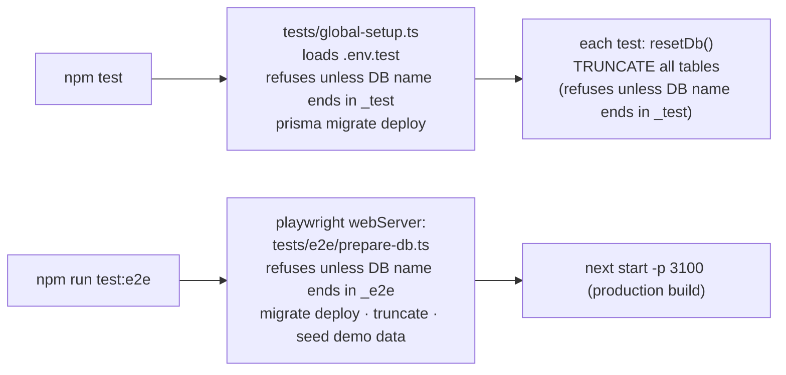

# Testing

[← Back to index](README.md)

| Suite | Tool | Tests | Runs against | Command |
|---|---|--:|---|---|
| Unit | Vitest | 25 | pure functions in `src/lib` | `npm test` |
| Integration | Vitest | 39 | **real PostgreSQL** (`hosiery_erp_test`) through the real services | `npm test` |
| End-to-end | Playwright (Chromium) | 23 | the **production build** on port 3100 with its own database (`hosiery_erp_e2e`) | `npm run build && npm run test:e2e` |

## Test databases (and their safety rails)



* `.env.test` points `DATABASE_URL`/`DIRECT_URL` at `hosiery_erp_test`. Integration tests run **one file at a time** (`fileParallelism: false`) because they share it.
* Nothing in the test tooling can wipe your development or production database; the name checks above enforce this.
* `server-only` is stubbed (`tests/server-only-stub.ts`), so services can be imported in Node.

## Unit tests (`tests/unit/`)

**`calculations.test.ts` (21)**
* Money precision: 100.10 + 200.20 = 300.30 exactly.
* Sale totals with line discount, bill discount and 5 % tax.
* Allocated line shares sum exactly to the total; discounts larger than the amount are rejected; all-zero carts work.
* `allocate` rounding remainder.
* Payments: change for cash, partial/unpaid status, overpayment rejected for UPI.
* Purchase totals with line discount, tax and bill discount.
* Returns: max returnable; over-return rejected; three partial refunds sum to the line amount exactly.
* Units: zero/negative/decimal-pairs/too-many-decimals/too-large quantities.
* BOM requirement maths; stock status thresholds.
* EAN-13 check digits; generated in-store barcodes always valid; scanner input normalisation; SKU builder.
* Business-timezone date ranges (today / yesterday / custom, including the IST midnight edge).

**`permissions.test.ts` (4)**
* Admin has everything.
* Store can receive, dispatch and return but not manage users/settings or cancel.
* Sales can bill, manage customers and return but can't adjust stock, receive or override prices.
* Unknown roles have nothing.

## Integration tests (`tests/integration/`)

These call the real services with real transactions, constraints and row locks.

**`inventory-flows.test.ts` (29)**
* **Products & barcode:** opening stock creates a ledger entry; barcode and SKU lookup; duplicate barcode/SKU rejected with friendly messages; sales role can't create products; token search; price changes audited.
* **Purchase:** receipt increases stock with exact totals and linked ledger rows; drafts don't touch stock and can't be received twice (also in parallel); the same idempotency key posts once even when 3 requests race; duplicate supplier invoice, inactive supplier and decimal pairs rejected; sales role can't purchase; cancellation reverses stock but fails if stock was sold; supplier return decreases stock and respects the limit.
* **Sale:** stock decreases with correct totals/change; unavailable stock rejected and **nothing** changes (not even the invoice counter); empty cart / zero / negative / decimal-pair / huge quantities rejected; **8 concurrent sales on 5 units → exactly 5 succeed**; double-click with the same key → one sale; price override only for admin; credit needs a customer; collecting payments; empty amount = paid in full (except credit); inactive products can't be sold; cancel restores stock and is blocked after returns.
* **Returns:** good → sellable, damaged → damaged only; sold 10 / returned 3 → 8 rejected, 7 accepted; refunds total the line amount exactly; duplicate and concurrent over-limit returns prevented; cancelled invoices rejected.
* **Adjustments:** damage/write-off/found/correction effects; never negative; reason required; sales role forbidden; user recorded.
* **Negative-stock setting:** overselling only when enabled.
* **Inventory listing:** low/out filters in SQL, pagination, token search (`ankle l` → only size L).

**`manufacturing-dispatch-auth.test.ts` (10)**
* **Production:** consumes raw materials and produces finished goods in one transaction with correct unit cost; shortage rejected with "Cotton Yarn: required 10 KG, available 7 KG" and nothing changes; duplicate posting prevented; concurrent runs can't over-consume; fractional whole-unit consumption, wrong product types and unauthorised BOM edits rejected; cancellation reverses both sides.
* **Dispatch:** packing rejected when "Required: 5, Scanned: 4"; full status flow and wrong-order transitions; sales role can't pack; returns blocked before dispatch; dispatch for a counter sale; duplicate dispatch rejected.
* **Auth & users:** login creates a hashed session; wrong password/unknown user/disabled user; logout; rate limiting; only admins manage users; deactivation kills sessions; last admin protected; passwords stored as bcrypt.

Many tests end with `verifyLedgerIntegrity()` returning `[]`.

## End-to-end tests (`tests/e2e/`)

Real browser, real production build, seeded demo data.

**`flows.spec.ts` (8): the required business flows**
1. **Purchase:** pick supplier → scan barcode → quantity 24 → *Receive stock* → inventory shows +24.
2. **Sale:** POS scan → repeat scan → `3*barcode` → quantity 5 → *Exact* → complete → invoice number → stock −5 → invoice page shows the item.
3. Unknown barcode shows "Product not found" + *Create product*; empty cart can't be completed.
4. **Good return:** +2 sellable; trying 3 more shows "Maximum additional return is 2".
5. **Damaged return:** sellable unchanged, damaged +1.
6. **Dispatch:** wrong item warning → 1/2 → 2/2 → "Required: 2, Scanned: 3" warning → pack → dispatch → complete; a forged pack API call with wrong counts gets 422.
7. **Manufacturing:** raw material via API → BOM via UI → 30 pairs blocked ("required 3 kg, available 2 kg") → 15 pairs produced → yarn 0.5 kg, gloves +15.
8. Ledger page shows sales, purchases and the running balance.

**`admin-day.spec.ts` (6)**
* Create a product with generated variants and auto barcodes; duplicate SKU message; add supplier and customer (with phone validation).
* Store records damage through the adjustment screen (negative result blocked).
* Admin prints an invoice (print media: chrome hidden, ₹470.93 incl. GST), cancels the sale with a reason (stock restored), and finds both events in the audit log.
* All five reports load and export CSV.
* Mobile 390 px POS: scan, open cart sheet, no horizontal overflow.
* Image upload stored in the database and served back byte-for-byte; a fake "PNG" is rejected.

**`search.spec.ts` (3)**
* Every list page's search applies, with and without matches (empty state shown).
* Row links and pagination navigate.
* The Ctrl+K palette search works.

**`security.spec.ts` (6)**
* Signed-out users redirected; APIs return 401, including with a forged cookie.
* Wrong password message.
* Sales role: no admin links, `/users` and `/inventory/adjust` redirect to *unauthorized*; direct API calls to adjust stock, override price or create a user → 403.
* Store role: adjust allowed, settings forbidden (page and API).
* Cross-site POST blocked.
* Two simultaneous identical sale submissions → one invoice.

## Running

```bash
npm test                      # unit + integration (needs PostgreSQL on 127.0.0.1:5433)
npm run build                 # E2E uses the production build
npm run test:e2e              # starts its own server on :3100 with hosiery_erp_e2e
npx playwright show-trace test-results/<test>/trace.zip   # debug a failure
```

Other checks: `npm run typecheck`, `npm run lint`.

## When you change something

| You changed… | Run at least |
|---|---|
| `lib/calculations.ts`, `lib/dates.ts`, `lib/barcode.ts` | `npm test` |
| any service / schema / migration | `npm test` |
| pages, forms, POS, navigation, `url-filters.tsx`, anything routing-related | `npm run build && npm run test:e2e` |
| added a `loading.tsx` or changed `Link` prefetching | **`tests/e2e/search.spec.ts`** (see [Frontend](frontend.md#why-there-are-no-loadingtsx-files-and-no-prefetching)) |
